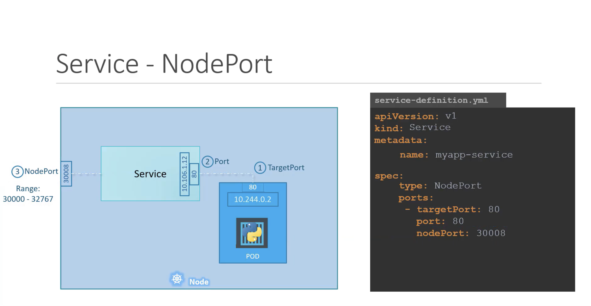
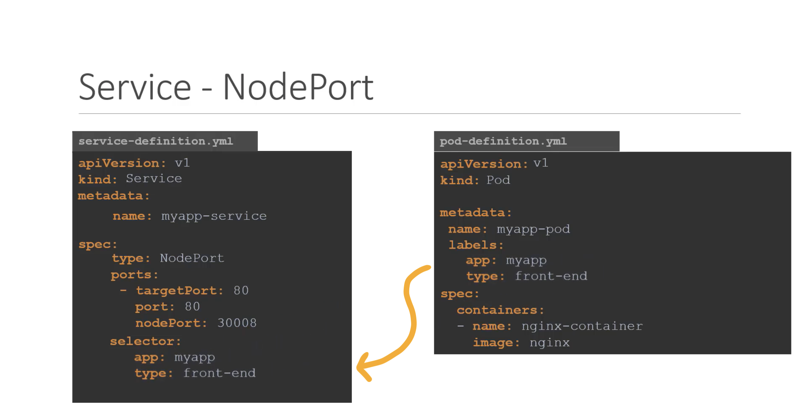

# Kubernetes for Kode Kloud - Core Concept

## 1. Core Concept
### 1-1. Practice Tests - Pods
* yaml 대신 명령어를 통해서 컨테이너 기동하는 방법
  - 파드 기동을 위한 yaml 생성
```yaml
apiVersion: v1
kind: Pod
metadata:
  name: pod-nginx
  labels:
    app: nginx-app
spec:
  containers:
    - name: nginx-container
      image: nginx
```
  - yaml 이용하거나 혹은 직접 기동하는 방법
```bash
bash> kubectl create -f pod-nginx.yml
bash> kubectl run nginx --image nginx
```

### 1-2. Practice Tests - ReplicaSets
* 아래와 같이 selector:tier 의 값과 metadata:labels:tier 가 같아야만 합니다
  - replicaset 기동을 위한 yaml 파일 생성
  - ReplicaSet 의 경우 Pod 에 대한 template 설정도 (metadata.labels) 해주어야 하고, Scheduling 을 위한 selector 설정도 (matchLabels) 해주어야 하기 때문에 조금 복잡해질 수 있습니다. 또한 자신의 metadata 설정도 (labels) 존재합니다
```yaml
apiVersion: apps/v1
kind: ReplicaSet
metadata:
  name: replicaset-busybox
  labels:
    app: rs1
    tier: frontend
spec:
  replicas: 2
  selector:
    matchLabels:
      tier: frontend
  template:
    metadata:
      labels:
        tier: frontend
    spec:
      containers:
      - name: busybox-container
        image: busybox
        command: ["/bin/sh"]
        args: ["-c", "echo Hello Kubernetes; sleep 3600"]
```
* replicas 변경 - 파일을 변경하거나, scale 명령을 통해 변경이 가능합니다
```bash
bash> kubectl replace -f replicaset-busybox-modified.yaml
bash> kubectl scale --replicas=3 -f replicaset-busybox.yaml
bash> kubectl scale --replicas=4 replicaset replicaset-busybox
```
* apply 는 replace 와 다르게 in-place 변경을 수행하므로 apply 한 객체에 대해서 적용하는 것이 적절하다
> The difference is that replace first deletes the resources, then creates it from the file you give it; whereas apply attempts to directly update, in the current live resource, only the attributes you give it in the file. See In-place updates and disruptive updates.


### 1-3. Practice Tests - Deployments
* 간단한 디플로이먼트 생성 - deployment 기동을 위한 yaml 파일 생성
```yaml
apiVersion: apps/v1
kind: Deployment
metadata:
  name: deployment-busybox  # 디플로이먼트를 통해 생성된 모든 객체에 붙게되는 이름
  labels:
    app: busybox-app-deploy # 현재 디플로이먼트의 이름
    type: backend           # 현재 디플로이먼트의 유형
spec:
  replicas: 2               # 복제 수
  selector:
    matchLabels:
      name: busybox-pod     # 파드 리플리케이션을 위한 라벨
      type: backend         # name, type 이 모두 일치하는 파드에 대한 리플리케이션
  template:
    metadata:
      labels:
        name: busybox-pod   # 현재 파드의 이름과, 유형
        type: backend
    spec:
      containers:
      - name: busybox-container
        image: busybox
        command: ["/bin/sh"]
        args: ["-c", "echo Hello Kubernetes; sleep 3600"]
```
* 파드, 서비스 부터 디플로이먼트까지 수동으로 배포합니다
```bash
bash> kubectl run nginx-pod --image=nginx:alpine
bash> kubectl run redis --image=redis:alpine --labels=tier=db
bash> kubectl expose pod redis --name redis-service --port 6379 --target-port 6379
bash> kubectl create deployment webapp --image=kodekloud/webapp-color
bash> kubectl scale deployment --replicas=3 webapp
bash> kubectl run custom-nginx --image=nginx:alpine --port 8080
```
* 임의의 yaml 파일을 생성해서 수정 후 배포합니다
```bash
bash> kubectl create ns dev-ns
bash> kubectl create deployment redis-deploy --image=redis:alpine -n dev-ns
bash> kubectl scale deployment --replicas=2 redis-deploy -n dev-ns --dry-run=client -o yaml > deployment-redis.yaml
bash> vi redis.yaml # replicas 를 2로 수정후
bash> kubectl apply -f deployment-redis.yaml
bash> kubectl get deployment.apps -n dev-ns
```
* 명령행에서 yaml 출력해보고 의도한 설정이 나오면 생성합니다 - 기본 서비스는 ClusterIP Type 이 됩니다
```bash
bash> kubectl run httpd --image=httpd:alpine --port 80 --expose --dry-run=client -o yaml 
bash> kubectl describe service httpd
```

### 1-4. Practice Test - Namespaces
* 네임스페이스는 메타데이터를 통해 지정됩니다
```yaml
apiVersion: v1
kind: Pod
metadata:
  name: nginx-app
  namespace: dev
  labels:
    app: nginx-pod
    type: frontend
spec:
  containers:
    - name: nginx-container
      image: nginx
```
* 네임스페이스 또한 별도로 생성 및 관리됩니다
```yaml
apiVersion: v1
kind: Namespace
metadata:
  name: dev
```
* 같은 혹은 다른 네임스페이스에 존재하는 서비스 접근
  - 같은 네임스페이스에서는 서비스명으로 접근 ex_ db-service
  - 다른 네임스페이스에서는 FQDN 으로 접근 db-service.dev.svc.cluster.local (Service: 서비스명.네임스페이스명.오브젝트명.도메인)
```bash
bash> kubectl get pods --all-namespaces
bash> kubectl describe service db-service
```
* 아래의 명령을 통해서 네임스페이스를 선택 및 변경가능합니다
```bash
bash> kubectl config set-context $(kubectl config current-context) --namespace=dev
bash> kubectl config set-context --current --namespace=dev
```
* 모든 네임스페이스에서 파드를 가져올 수 있습니다
```bash
bash> kubectl get pods --all-namespaces
bash> kubectl get namespaces --no-headers
```
* 특정 네임스페이스의 리소스 사용량([Resource Quota](https://kubernetes.io/docs/concepts/policy/resource-quotas/))을 조정합니다
```yaml
apiVersion: v1
kind: ResourceQuota
metadata:
  name: resource-quota-dev
  namespace: dev
spec:
  hard:
    pods: "10"
    requests.cpu: "2"
    requests.memory: 5Gi
    limits.cpu: "4"
    limits.memory: 10Gi
```
* 리소스 쿼터 내용을 확인합니다
```bash
bash> kubectl describe namespace dev
Name:         dev
Labels:       <none>
Annotations:  <none>
Status:       Active

Resource Quotas
 Name:            resource-quota-dev
 Resource         Used  Hard
 --------         ---   ---
 limits.cpu       0     4
 limits.memory    0     10Gi
 pods             0     10
 requests.cpu     0     2
 requests.memory  0     5Gi
```
* 임의의 redis 파드를 생성하되 CLI 환경에서 확인 후 네임스페이스를 수정합니다
  - namespace 항목을 추가하여 pod-with-namespace.yaml 로 저장합니다
  - quota 제약이 있기 때문에 quota: resource-quota-dev: must specify limits.cpu,limits.memory,requests.cpu,requests.memory 값 설정이 필요합니다
```bash
bash> kubectl run redis --image=redis --dry-run=client -o yaml | vi -
```
```yaml
apiVersion: v1
kind: Pod
metadata:
  creationTimestamp: null
  labels:
    run: redis
  name: redis
  namespace: dev
spec:
  containers:
  - image: redis
    name: redis
    resources:
      requests:
        memory: "1Gi"
        cpu: "100m"
      limits:
        memory: "2Gi"
        cpu: "200m"
  dnsPolicy: ClusterFirst
  restartPolicy: Always
status: {}
```


### 1-5. Practice Tests - NodePort Services
> 서비스는 노드에 할당된 물리적인 IP 와 PORT 정보를 이용하여, 파드에 할당된 IP 와 컨테이너에 할당된 PORT 정보에 대한 맵핑을 통한 연동을 시켜주는 서비스입니다. 즉 여기서 기인한 이름이 "NodePort Service" 입니다. 즉, 해당하는 노드의 물리적인 IP 정보를 알고 있다고 가정할 때에 사용할 수 있습니다
* 서비스는 파드를 향한 요청에 대해 노드의 포트를 연결해 주는 서비스입니다
  - Service listens to Port on the Node that Requests on the Pods

| Type | Description |
|---|---|
| Node Port | 노드의 특정 포트를 파드의 포트와 연결해 주는 기능 |
| ClusterIP | 가상의 IP 를 내부 IP로 사용할 수 있도록 생성하는 기능 |
| LoadBalancer | 부하분산 및 서비스 격리를 제공하는 L7과 같은 기능 |

* NodePort
  - Node(192.168.0.1):30001 -> Service(10.1.1.2):80 -> Pod(10.1.1.10):80

```yaml
apiVersion: v1
kind: Pod
metadata:
  name: pod-nginx
  labels:
    app: nginx-app
spec:
  containers:
    - name: nginx-container
      image: nginx
      ports:
        - containerPort: 80
```

```yaml
apiVersion: v1
kind: Service
metadata:
  name: service-nginx
spec:
  type: NodePort
  ports:
    - protocol: TCP
      port: 80
      targetPort: 80
      nodePort: 30001
  selector:
    app: nginx-app
```
* minikube 에서 서비스를 기동한다면 Node 의 IP 로 접근할 수 없기 때문에 아래와 같이 터널링이 필요합니다
  - 물리적인 노드가 있다면 NodeIP:30001 로 접속할 수 있지만, minikube 는 별도의 파드에서 기동되기 때문에 localhost 에 임의의 포트에 다시 맵핑됩니다
```bash
bash> minikube service list

|----------------------|---------------------------|--------------|-----|
|      NAMESPACE       |           NAME            | TARGET PORT  | URL |
|----------------------|---------------------------|--------------|-----|
| default              | kubernetes                | No node port |     |
| default              | service-nginx             |           80 |     |
| kube-system          | kube-dns                  | No node port |     |
| kube-system          | metrics-server            | No node port |     |
| kubernetes-dashboard | dashboard-metrics-scraper | No node port |     |
| kubernetes-dashboard | kubernetes-dashboard      | No node port |     |
|----------------------|---------------------------|--------------|-----|

bash> minikube service service-nginx
|-----------|---------------|-------------|-------------------------|
| NAMESPACE |     NAME      | TARGET PORT |           URL           |
|-----------|---------------|-------------|-------------------------|
| default   | service-nginx |          80 | http://172.17.0.2:30001 |
|-----------|---------------|-------------|-------------------------|
🏃  Starting tunnel for service service-nginx.
|-----------|---------------|-------------|------------------------|
| NAMESPACE |     NAME      | TARGET PORT |          URL           |
|-----------|---------------|-------------|------------------------|
| default   | service-nginx |             | http://127.0.0.1:51425 |
|-----------|---------------|-------------|------------------------|
🎉  Opening service default/service-nginx in default browser...
❗  Because you are using a Docker driver on darwin, the terminal needs to be open to run it.
```
[!kkc-3](images/kkc-3.png)
* 디플로이먼트와 파드가 존재하는 상황에서 서비스를 생성하는 예제
```bash
bash> kubectl expose deployment name-of-deployment --name name-of-service --port=8080 --target-port=8080 --type=NodePort --dry-run=client -o yaml | vi -
vim> # 설정에서 NodePort: 30001 과 같이 설정하면 30001(NodePort) -> Service(8080:8080) -> Pod(8080) 연결시키는 서비스가 생성됩니다
```


### 1-6. Practice Tests - Imperative Commands
> Imperative 와 Declarative 명령의 차이는 네비게이션에 따라 목적지에 순차적으로 이동하는 방법과, 우버를 통해 목적지를 선택하는 것과 같은 차이입니다. 

* Imperative Commands Style
  - edit 명령을 통한 변경은 쿠버네티스에 변경을 직접 가하는 것이므로 로컬의 yaml 과 정합성이 맞지 않게 되므로, --force 를 통해 replace 해야할 수도 있습니다
  - create 로 생성한 것은 yaml 기반으로 형상관리를 하고, replace 통해 수행하는 것이 적절합니다
```bash
# Create Objects
bash> kubectl run --image:nginx nginx
bash> kubectl create deployment --image=nginx nginx
bash> kubectl expose deployment nginx --port=80

# Update Objects
bash> kubectl edit deployment nginx
bash> kubectl scale deployment replicas=3
bash> kubectl set image deployment nginx nginx=nginx:1.18
bash> kubectl create -f nginx.yaml
bash> kubectl replace -f nginx.yaml
bash> kubectl delete -f nginx.yaml
```
* Declarative Style
  - 항상 apply 명령을 통해서 createOrReplace 하고, yaml 기준으로 계속 apply 하게되면 오류나 충돌을 걱정하지 않고 이력도 관리되어 안전합니다
```bash
bash> kubectl apply -f nginx.yaml
```


