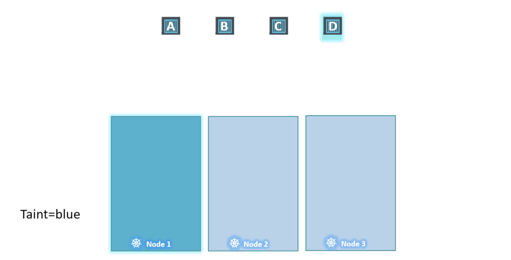
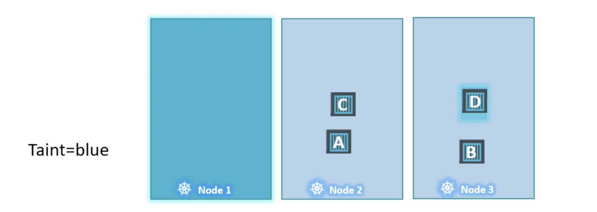
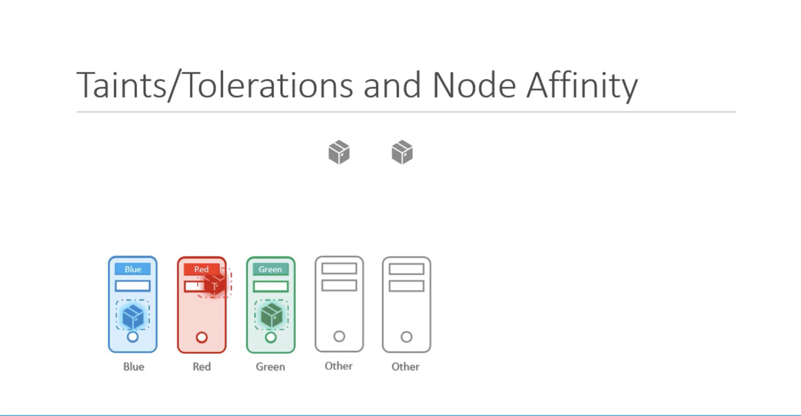

# Kubernetes for Kode Kloud - Scheduling

## 1. Scheduling

### 1-1. 수동 스케줄링
> YAML 파일에는 직접 nodeName 을 명시할 수는 없지만 파드가 생성되는 시점에 (즉, 스케줄링 되는) 해당 값이 갱신됩니다. 혹은 Binding 오브젝트를 통해 수행하는 것이 가능합니다
* kube-system 네임스페이스에 scheduler 가 기동되어 있지 않다면, 파드는 특정 노드에 할당되지 못하는데, 이 때에 명시적으로 nodeName 설정을 통해 변경이 가능합니다
  - 아래와 같이 Binding 객체를 통해 수행하는 방법도 있지만
```yaml
apiVersion: v1
kind: Binding
metadata:
  name: nginx
target:
  apiVersion: v1
  kind: Node
  name: node02
```
  - 생성된 yaml 파일을 curl 통해 전송합니다
```bash
bash> curl --header "Content-Type:application/json" --request POST --data '{"apiVersion": v1 ... }' http://$SERVER/api/v1/namespaces/default/pods/$PODNAME/binding/
```
* 파드의 nodeName 값을 변경할 수도 있습니다
```yaml
apiVersion: v1
kind: Pod
metadata:
  name: my-pod-spec
spec:
  containers:
  - name: my-pod
    nodeName: 
```

### 1-2. 라벨 및 셀렉터
* 라벨 출력 및 라벨을 통한 필터
  - ```--show-labels``` 옵션으로 라벨 출력
  - ```--selector | -l``` 옵션으로 필터링
```bash
bash> kubectl get pods --show-labels --selector app=nginx --no-headers
bash> kubectl get all -l env=prod,bu=finance --no-headers
```
* 라벨을 통해 파드를 관리하는 레플리카셋 예제
```yaml
apiVersion: apps/v1
kind: ReplicaSet
metadata:
  labels:
    app: app1
    type: front-end
spec:
  replicas: 3
  selector:
    matchLabels:
      app: app1
  template:
    metadata:
      labels:
        app: app1
        type: front-end
    spec:
      containers:
      - name: nginx-container
        image: nginx
```

### 1-3. 얼룩과 허용
> 특정 노드나 파드에 뭍어있는 색깔이나 오염된 것을 허용할 수 있는지로 이해할 수 있으며. 특정 노드나 파드에 배포할 수 있는지 여부를 제약하기 위한 도구입니다. 즉, 특정 노드에는 내가 원하는 어플리케이션만 배포하고 싶다면 특정 노드에 얼룩을 뭍혀두면 일반적인 어플리케이션은 해당 노드에 배포되는 것을 허용되지 않도록 스케줄링 된다는 의미입니다


* 얼룩(taints)은 노드에 뭍이고, 인내심(toleration)은 파드가 가져야 하며, 아래와 같은 3가지 효과를 가집니다
  - NoSchedule : 해당 노드에 스케줄링 되지 않습니다
  - PrefereNoscheduler : 최대한 해당 노드에 스케줄링 하지않으려 합니다
  - NoExecute : 이미 떠 있는 노드에도 허용할 수 없는 경우 제거(Evict) 됩니다
* 노드에 아래와 같이 얼룩을 뭍힙니다
```bash
bash> kubectl taint nodes node1 app=blue:NoSchedule
```
* 파드에도 마찬가지로 허용가능한 수준의 인내심을 가지게 합니다
  - tolerations 항목을 추가하여 노드와 같은 값을 작성하되 반드시 **쌍따옴표로 감싸**주어야 합니다
```yaml
apiVersion: v1
kind: Pod
metadata:
  name: pod-nginx
spec:
  containers:
  - name: nginx-container
    image: nginx
  tolerations:
  - key: "app"
    operator: "Equal"
    value: "blue"
    effect: "NoSchedule"
```
* 반면에 특정 노드에 오염이 있다고 하더라도 반드시 그 노드에만 배포도도록 강제할 수는 없습니다
  - 이러한 기능은 Node Affinity 등을 통해 구현이 가능합니다 (ex_ MasterNode)

```bash
bash> kubectl taint node node01 spray=mortein:NoSchedule
bash> kubeclt describe node node01 | grep -i taint
bash> kubectl run mosquito --image=nginx --restart=Never

bash> kubectl run bee --image=nginx --restart=Never --dry-run=client -o yaml > bee.yaml
bash> kubectl explain pod --recursive | less
bash> kubectl explain pod --recursive | grep -A5 tolerations

bash> cat bee.yaml
...
  tolerations  <[]Object>
     - effect  <string>
       key  <string>
       operator  <string>
       tolerationSeconds  <integer>
       value  <string>
...

bash> kubectl apply -f bee.yaml
```
* 뭍어있는 얼룩을 제거하는 방법
  - 모든 라벨 및 얼룩 등은 명령어 끝에 마이너스(-)를 붙여서 제거합니다
```bash
bash> kubectl taint nodes node01 spary=mortein/NoSchedule-
```

### 1-4. 노드 셀렉터
> 파드 설정 파일 생성 시에 spec.nodeSelector 설정으로 노드의 크기를 선택할 수 있습니다
* 라벨을 통해 대상 노드의 설정을 변경할 수 있습니다
  - Taints 와는 다르게 Label 을 사용합니다
```yaml
apiVersion: v1
kind: Pod
metadata:
  name: nginx-pod
spec:
  containers:
  - name: nginx-container
    image: nginx
  nodeSelector:
    size: Large
```
* 라벨을 설정합니다
```bash
bash> kubectl label node key=value
```

### 1-5. 노드 선호도
> 노드 셀렉터의 엄격한 선택과 다르게 가중치 혹은 선호도를 통해서 보다 유연한 노드 설정이 가능합니다
* 관련 매뉴얼을 찾기 어려울 때에는 explain 명령을 활용합니다
```bash
bash> kubectl explain --recursive pod | grep -i -A10 affinity
      affinity  <Object>
         nodeAffinity  <Object>
            preferredDuringSchedulingIgnoredDuringExecution  <[]Object>
               preference  <Object>
                  matchExpressions  <[]Object>
                     key  <string>
                     operator  <string>
                     values  <[]string>
                  matchFields  <[]Object>
                     key  <string>
                     operator  <string>
                     values  <[]string>
```
* 노드 어피니티 설정
  - DuringScheduling : 노드에 스케줄링 되기 전에 가져야하는 레이블 설정 (required)
  - DuringExecution : 이미 실행 중인 노드에는 영향을 미치지 않음 (Ignoring)
  - requiredDuringSchedulingIgnoredDuringExecution : 실행중인 작업은 건드리지 않고, 원하는 라벨이 존재하는 노드에만 배포합니다
  - preferredDuringSchedulingIgnoredDuringExecution : ... 가능한 해당 노드에 배포합니다
  - requiredDuringSchedulingRequredDuringExecution (Not Yet) : 원하는 노드가 다 차 있는 경우 제거 가능한 파드를 제거후, 배포합니다
```yaml
apiVersion: v1
kind: Pod
metadata:
  name: nginx-pod
spec:
  containers:
  - name: nginx-container
    image: nginx
  affinity:
    nodeAffinity:
      requiredDuringSchedulingIgnoredDuringExecution:
        nodeSelectorTerms:
          - matchExpressions:
            - key: size
              operator: In
              values:
              - Large
```
* apply 하는 경우 node 설정이 변경될 때에 정상 노드를 생성하고 난 이후, Terminating 하는 것처럼 보인다  
  - operator 가 In 외에도 NotIn, Exists, DoesNotExist, Gt, Lt 등도 존재하므로 다양한 예제를 경험해 보는 것이 좋다
  - [Assign-pod-node](https://kubernetes.io/docs/concepts/scheduling-eviction/assign-pod-node/) 페이지 참고


### 1-6. 자원 요구사항 및 제한
> CPU, Memory, Disk 기준으로 리소스를 요청 및 허용됩니다

* 리소스 요청 resources.requests.{memory,cpu}
  - [Kubernetes best practices: Resource requests and limits](https://cloud.google.com/blog/products/gcp/kubernetes-best-practices-resource-requests-and-limits) 참고
  - CPU : 최소 0.1 까지 사용할 수 있으며 100m 밀리코어 단위로 사용할 수도 있습니다. 예를 들어 2개의 CPU 를 모두 온전히 사용하고 싶다면 2 또는 2000m을 하나의 CPU를 1/4만 사용하고 싶다면 0.25 혹은 250m 로 설정합니다 (1 AWS vCPU = 1 GCP Core = 1 Azure Core = 1 Hyperthread)
  - Memory : 단위가 M(Megabyte),G(Gigabyte) 단위는 1,024가 아니라 1,000 을 말하므로, Gi(Gibibyte), Mi(Mebibyte) 표현을 사용하여 1024 단위로 사용하는 것이 정확합니다.
* 리소스 제한 resources.limits.{memory,cpu}
  - CPU 의 경우는 limit 를 넘어서는 사용이 불가능하지만, Memory 는 넘어설 수 있으며 그러한 경우 해당 파드가 종료될 수 있음에 주의해야 합니다
* LimitRange 객체를 통해 기본 리소스 제한
  - 특정 네임스페이스에 대하여 아래와 같이 CPU 및 Memory 에 대한 기본 제한을 둘 수 있습니다
* [Configure Default Memory Requests and Limits for a Namespace](https://kubernetes.io/docs/tasks/administer-cluster/manage-resources/memory-default-namespace/)
```yaml
apiVersion: v1
kind: LimitRange
metadata:
  name: cpu-memory-limit-range
spec:
  limits:
  - default:
      cpu: 1
      memory: 512Mi
    defaultRequest:
      cpu: 0.5
      memory: 256Mi
    type: Container
```

* 파드의 환경 정보의 수정은 아래의 몇 가지를 제외한 나머지는 불가능하기 때문에, 삭제 후 다시 생성하거나, 기존의 yaml 을 이용해서 다른 파드를 생성해야만 합니다
```yaml
- spec.containers[*].image
- spec.initContainers[*].image
- spec.activeDeadlineSeconds
- spec.tolerations
```

### 1-7. 데몬셋
> 모든 노드에 하나의 파드를 모두 배포될 수 있도록 구성하는 복제 구성을 말합니다. 예를 들어 모니터링 혹은 로그 등의 기능을 수행하기 위한 파드에 적합합니다

* 큐브 프록시와 같은 파드가 좋은 예제이며, 아래와 같습니다.
  - 다만, 직접 타이핑이 어렵기 때문에 가장 유사한 Deployment 로 생성하여 yaml 파일을 만들고, replicas 및 필요 없는 정보만 삭제하여 활용하면 됩니다
```yaml
apiVersion: v1
kind: DaemonSet
metadata:
  name: monitoring-daemonset
spec:
  selector:
    matchLabels:
      app: monitoring-agent
  template:
    metadata:
      labels:
        app: monitoring-agent
    spec:
      containers:
      - name: monitoring-agent
        image: monitoring-agent
```
### 1-8. 정적파드
> 어떠한 관련 서비스도 존재하지 않고 kubelet 만 존재한다고 할때, Kubelet 은 유일하게 수행 가능한 일이 파드를 생성하는 것이므로 /etc/kubernetes/manifest 파일을 통해서 파드를 생성 및 관리할 수 있습니다. 반면에 큐블랫이 생성한 파드가 클러스터의 일부라면, 큐브 API 서버에도 이와 동일한 읽기 전용 미러 객체 또한 생성됩니다. 즉 큐블렛이 API 서버에 관련 정보를 계속 전송하게 됩니다.

* 정적 파드의 내부 구조
[kcc-6](images/kcc-6.png)

* 정적 파드는 왜 필요한가요?
  - 초기에 Master 노드를 구성할 때에는 어떠한 의존성을 가진 서비스가 없어도 구성이 될 수 있어야 하기 때문입니다
  - apiserver.yaml, etcd.yaml, controller-manager.yaml 즉, Control Plain 구성을 위해서는 반드시 정적 파드 구성이 가능해야만 합니
[kcc-8~9](images/kcc-8.png)
[kcc-8~9](images/kcc-9.png)

* 정적파드 구성과 데몬셋 구성으로 운영되는 파드의 종류
  - 두 가지 모두 큐브 스켈줄러의 영향을 받지 않는 특징을 가지고 있습니다
| 정적 파드 | 데몬셋 |
| --- | --- |
| 큐블렛에 의해 생성 | 큐브 API 서버를 통해 생성 |
| 컨트롤 플레인 컴포넌트로써 배포 | 모니터링, 로깅 에이전트로써 배포 |

 

## 2. Practice and Test

### 2-1. Manual Scheduling

### 2-2. Labels and Selectors

### 2-3. Taints and Tolerations

### 2-4. Node Affinity

### 2-5. Resource Limits

### 2-6. DaemonSets

### 2-7. Static PODs

### 2-8. Multiple Schedulers

