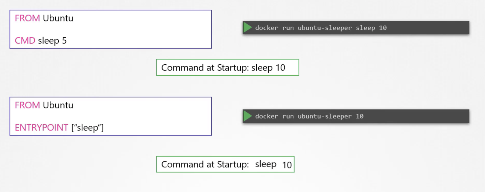
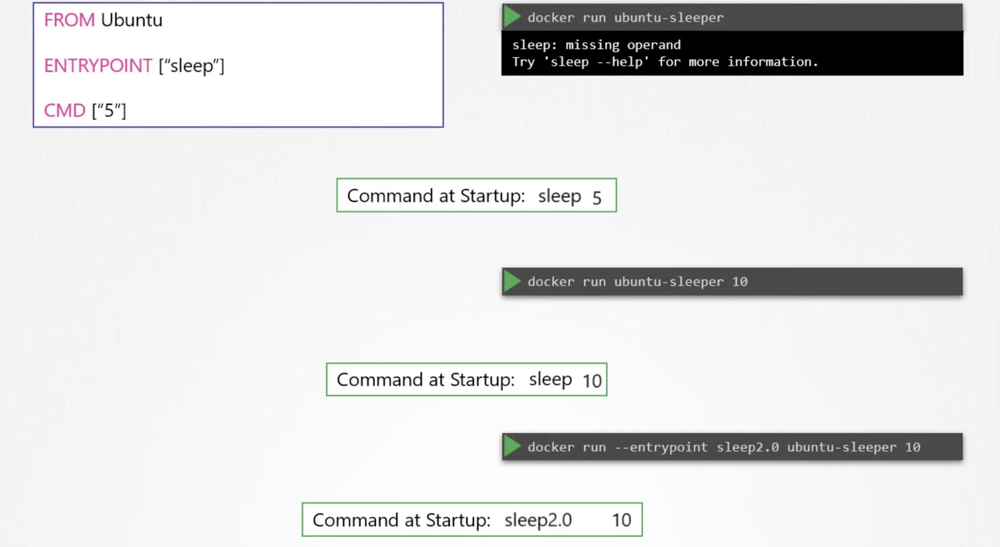

# Application Lifecycle Management
> 배포 시에 어떻게 스케일링 할 것인 지에 대한 이야기를 합니다

## 1. Rolling Updates and Rollbacks

* Recreate Strategy
  - 모든 서비스를 일괄 내리고, 다시 올리는 전략을 말하는데 Application Downtown 이 발생하는 단점이 있습니다
* Rolling Update (Default)
  - 하나씩 종료 및 시작함으로써 서비스 다운 타임이 발생하지 않도록 하는 전략입니다

* How to update
  - 직접 이미지를 변경하는 것도 가능하지만, yaml 파일과 서버와 달라지는 점을 유의해야 합니다
```bash
bash> kubectl apply -f deployment.yaml
bash> kubect set image deployment/my-deployment nginx=nginx:1.9.1
```
* Create, Get, Update, Status & Rollback 커맨드
```bash
bash> kubectl create -f deployment.yml
bash> kubectl get deployments
bash> kubectl apply -f deployment.yml
      kubectl set image deployment/myapp-deployment nginx=nginx:1.9.1
bash> kubectl rollout status deployment/myapp-deployment
      kubectl rollout history deployment/myapp-deployment
      kubectl rollout undo deployment/myapp-deployment
```
* Docker Entrypoint & Commands


* 도커 슬립 Dockerfile 을 생성합니다
```Dockerfile
FROM ubuntu:18.04
ENTRYPOINT ["sleep"]
CMD ["5"]
```
* 아래의 명령은 모두 동일하게 5초 슬립 후에 종료됩니다 
```bash
bash> docker build -t local/ubuntu-sleeper .
bash> docker run local/ubuntu-sleeper
bash> docker run local/ubuntu-sleeper 5
bash> docker run --entrypoint sleep local/ubuntu-sleeper 5
```
* 쿠버네티스에서 동일한 수행을 위해서 파드 구성을 합니다
```yaml
apiVersion: v1
kind: Pod
metadata:
  name: sleep-pod
spec:
  containers:
  - name: ubuntu-sleeper
    image: ubuntu-sleeper
    command: ["sleep"]
    args: ["5"]
```
| 구분 | 시작 명령어 | 파라메터 |
| --- | --- | --- |
| Docker | ENTRYPOINT | CMD |
| Kubernetes | COMMAND | ARGS |


## 

