# Application Lifecycle Management
> 배포 시에 어떻게 스케일링 할 것인 지에 대한 이야기를 합니다

## 1. Rolling Updates and Rollbacks

* Recreate Strategy
  - 모든 서비스를 일괄 내리고, 다시 올리는 전략을 말하는데 Application Downtown 이 발생하는 단점이 있습니다
* Rolling Update (Default)
  - 하나씩 종료 및 시작함으로써 서비스 다운 타임이 발생하지 않도록 하는 전략입니다

* 디플로이먼트([Deployments](https://kubernetes.io/docs/concepts/workloads/controllers/deployment/)) 객체를 통한 파드 업데이트
  - 직접 이미지를 변경하는 것도 가능하지만, yaml 파일과 서버와 달라지는 점을 유의해야 합니다
```bash
bash> kubectl apply -f deployment.yaml
bash> kubect set image deployment/my-deployment nginx=nginx:1.9.1
```
* Create, Get, Update, Status & Rollback 커맨드
```bash
bash> kubectl create -f deployment.yml
bash> kubectl get deployments
bash> kubectl apply -f deployment.yml
      kubectl set image deployment/myapp-deployment nginx=nginx:1.9.1
bash> kubectl rollout status deployment/myapp-deployment
      kubectl rollout history deployment/myapp-deployment
      kubectl rollout undo deployment/myapp-deployment
```
* Docker Entrypoint & Commands
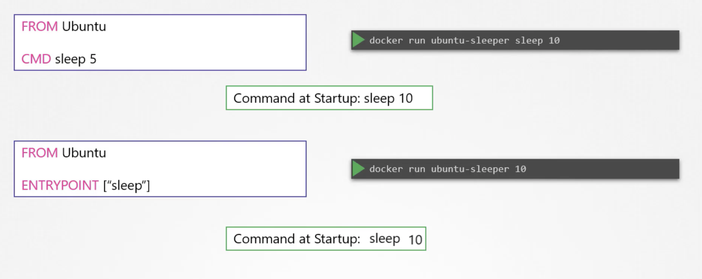
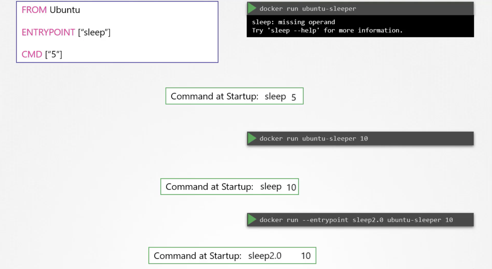
* 도커 슬립 Dockerfile 을 생성합니다
```Dockerfile
FROM ubuntu:18.04
ENTRYPOINT ["sleep"]
CMD ["5"]
```
* 아래의 명령은 모두 동일하게 5초 슬립 후에 종료됩니다 
```bash
bash> docker build -t local/ubuntu-sleeper .
bash> docker run local/ubuntu-sleeper
bash> docker run local/ubuntu-sleeper 5
bash> docker run --entrypoint sleep local/ubuntu-sleeper 5
```
* 쿠버네티스에서 동일한 수행을 위해서 파드 구성을 합니다
```yaml
apiVersion: v1
kind: Pod
metadata:
  name: sleep-pod
spec:
  containers:
  - name: ubuntu-sleeper
    image: ubuntu-sleeper
    command: ["sleep"]
    args: ["5"]
```
| 구분 | 시작 명령어 | 파라메터 |
| --- | --- | --- |
| Docker | ENTRYPOINT | CMD |
| Kubernetes | COMMAND | ARGS |

## 2. Environment Variables
> 크게 세 가지(Plain Key, Value, ConfigMap, Secrets) 환경변수 유형이 존재합니다
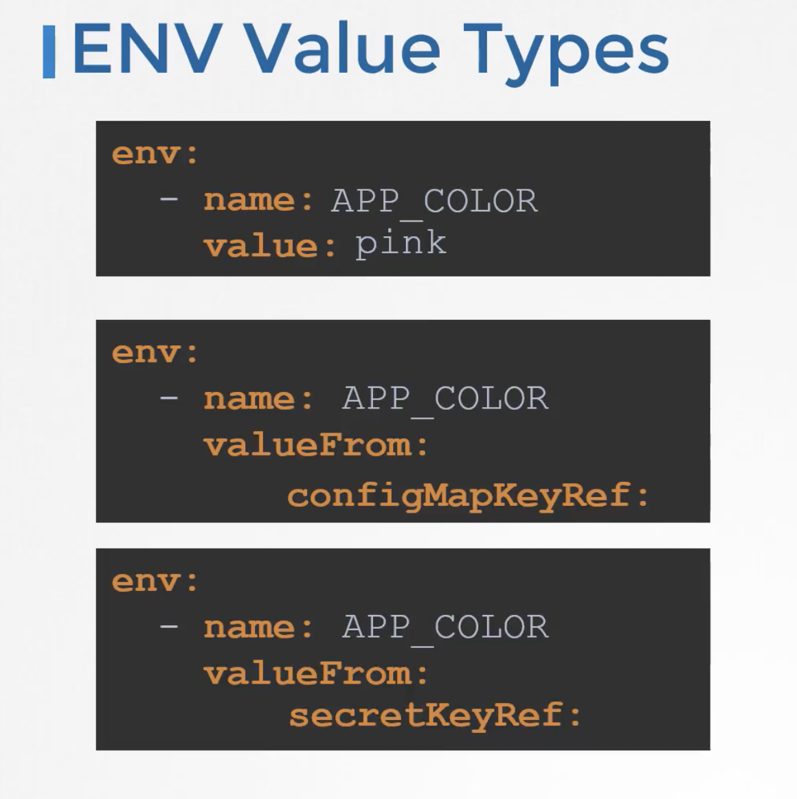

* Create ConfigMaps w/ Imperative and Declarative Stsyle
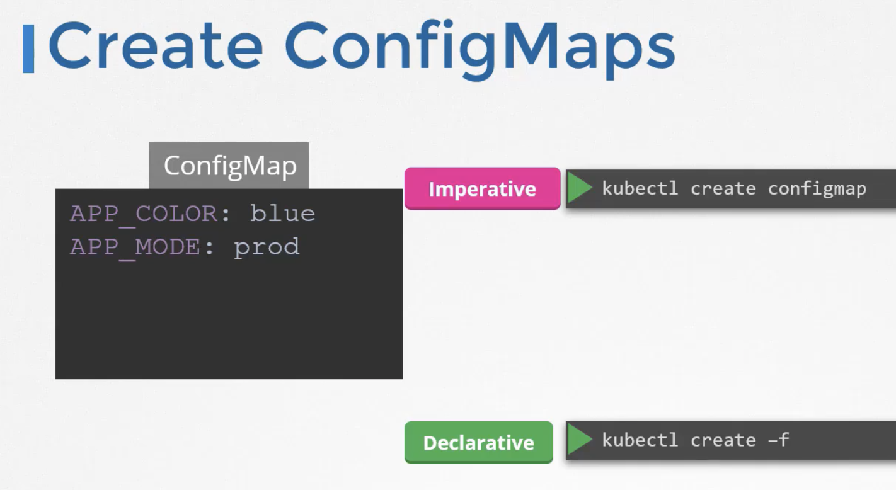
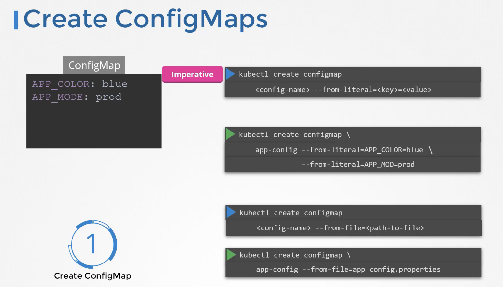


* 기존 생성된 파드를 통해 yaml 획득 및 ConfigMaps 생성 및 확인
```bash
bash> kubectl get pods <name-of-pod> -o yaml | vi -
bash> kubectl get configmaps
bash> kubectl get cm

bash> kubectl describe cm <name-of-configmaps>
bash> kubectl create cm <name-of-cm> --from-literal=KEY1=VALUE1
bash> kubectl explain pod --recursive | grep -i -A10 envFrom
```
* 파드 환경변수를 컨피그맵을 통해 가져오는 방법
  - 아래의 name 이 configMapRef 와 같은 레벨에 있으면 안됩니다
```yaml
containers:
- envFrom:
  - configMapRef:
      name: config-map-name
```
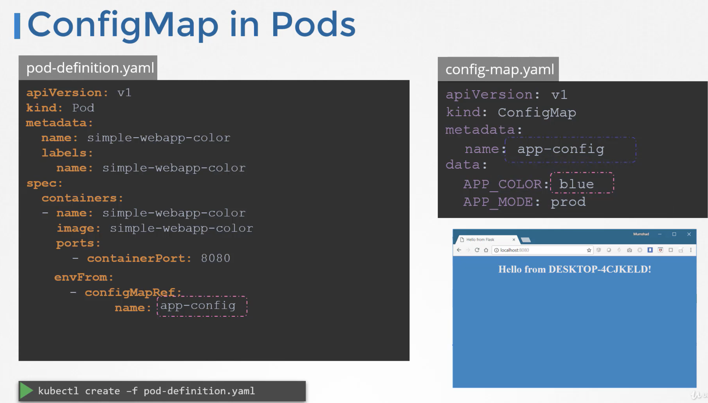

## 3. Secrets
> configmap 의 경우 모두 평문으로 저장되므로 비번 등은 다음의 secret 을 통해 저장되어야 합니다
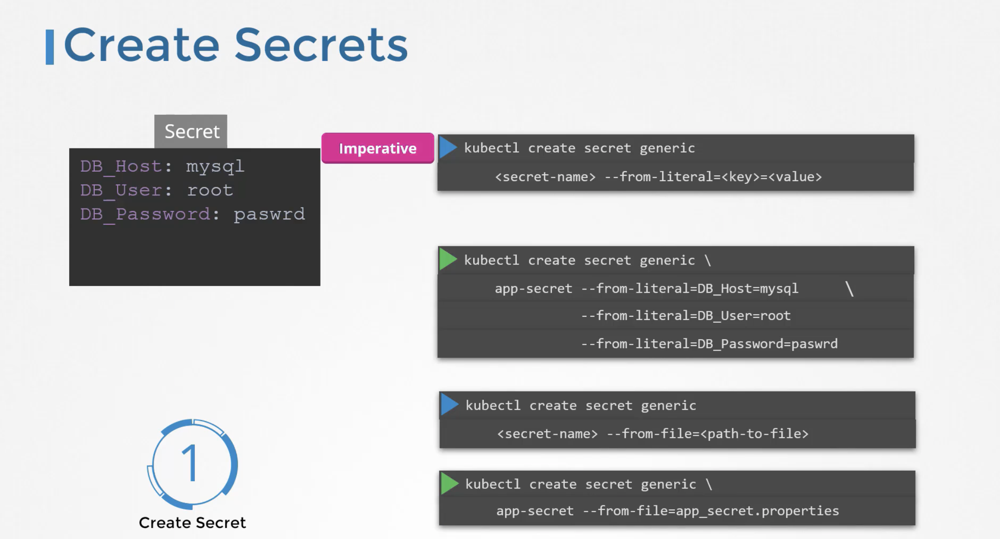
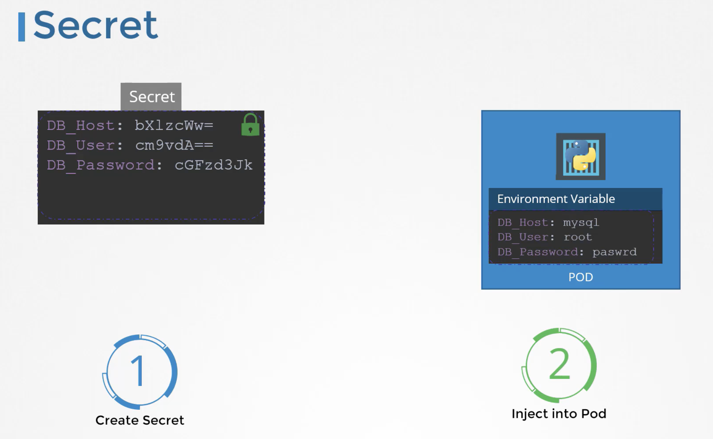

* Create Secrets Imperative Style
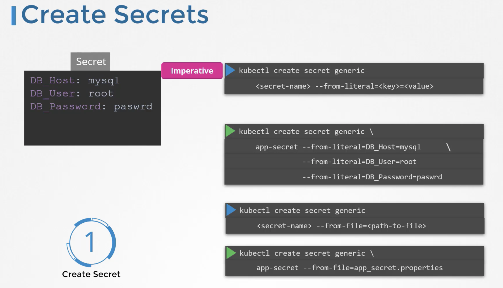
```bash
bash> kubectl get secrets
bash> kubectl describe secrets <name-of-secret>
bash> kubectl get pods,services
```

* Create Secrets Declarative Style
  - secrets 가 아니라 secret 이어야 합니다
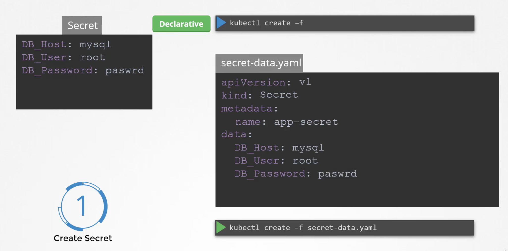
```bash
bash> kubectl create secret generic <name-of-secret> --from-literal=K1=V1 --from-literal=K2=V2
```

* 일반적인 Base64 인코딩/디코딩 하는 방법 
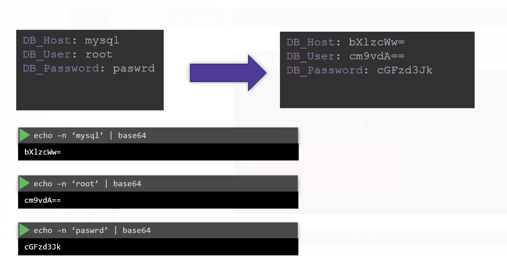
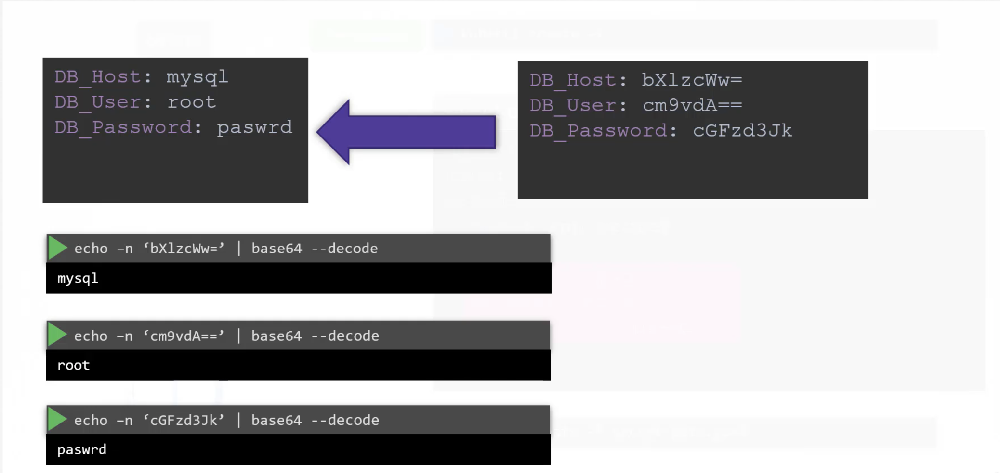
```yaml
apiVersion: v1
kind: Pod
metadata:
  name: name-of-pod
specs:
  containers:
  - image: nginx
    name: nginx-continaer
    envFrom:
    - secretRef:
        name: name-of-secret
```

* 시크릿([Secrets](https://kubernetes.io/docs/concepts/configuration/secret/)) 정보를 환경변수 혹은 볼륨으로 마운트 하는 방법


## 4. Multi Container Pod Managements
> 다중 컨테이너 파드 설계는 크게 3가지(Sidecar, Adapter, Ambassador)로 구분되며, CKAD 커리큘럼에서 자세히 다루고, Sidecar 실습만 합니다
* Sidecar 방식을 통한 멀티 컨테이너 설정
```yaml
apiVersion: v1
kind: Pod
metadata:
  name:
specs:
  containers:
  - name: busybox
    image: busybox
    command: [ "sh", "-c", "sleep 3000" ]
  - name: redis
    image: redis
```
* 컨테이너 초기화([Init Containers](https://kubernetes.io/docs/concepts/workloads/pods/init-containers/))를 통한 준비
  - 깃헙을 통해 클론을 받아오는 예제
```yaml
apiVersion: v1
kind: Pod
metadata:
  name: myapp-pod
  labels:
    app: myapp
spec:
  containers:
  - name: myapp-container
    image: busybox:1.28
    command: ['sh', '-c', 'echo The app is running! && sleep 3600']
  initContainers:
  - name: init-myservice
    image: busybox
    command: ['sh', '-c', 'git clone <some-repository-that-will-be-used-by-application> ; done;']
```
  - 각 서비스가 정상적으로 기동 되었는지 확인하는 예제
  - 여러개의 초기화 작업은 순차적으로 수행됩니다
```yaml
apiVersion: v1
kind: Pod
metadata:
  name: myapp-pod
  labels:
    app: myapp
spec:
  containers:
  - name: myapp-container
    image: busybox:1.28
    command: ['sh', '-c', 'echo The app is running! && sleep 3600']
  initContainers:
  - name: init-myservice
    image: busybox:1.28
    command: ['sh', '-c', 'until nslookup myservice; do echo waiting for myservice; sleep 2; done;']
  - name: init-mydb
    image: busybox:1.28
    command: ['sh', '-c', 'until nslookup mydb; do echo waiting for mydb; sleep 2; done;']
```

