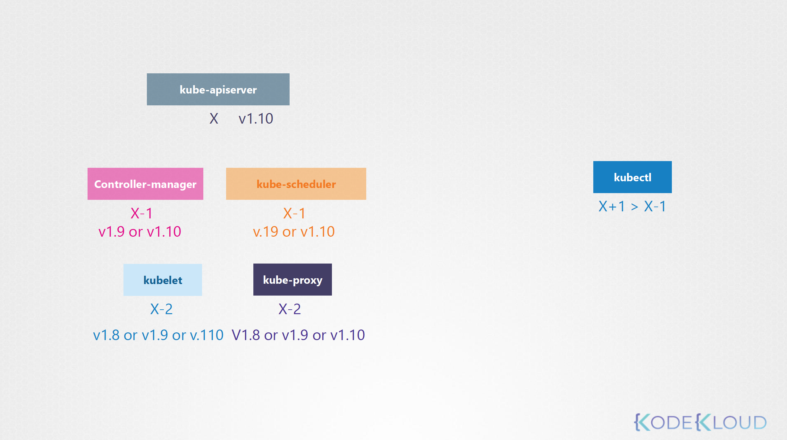

# Kubernetes for Kode Kloud - Cluster Maintenance
> 임의의 노드가 다운되고, 5분(--pod-eviction-timeout=5m0s)이 지나면 새로운 노드가 생성되고 해당 노드에 존재하던 파드는 복구됩니다. 하지만 노드의 장애 혹은 점검이 예상할 수 있다면, 해당 노드의 파드가 완전히 복원되는 것을 기다리기 보다는 다른 노드로 옮기는(drain) 동작을 통해 해당 노드를 비우는 것이 더 낫습니다. 


## 1. OS Upgrades

* 예상되는 노드의 작업 시에 활용 가능한 노드 관리
  - drain: 특정 노드의 모든 파드를 제거 하고, 다른 노드로 옮기는 작업 (cordon도 같이 수행됨)
  - uncordon: 새로 기동된 노드에 스케줄이 가능하도록 준비하는 작업
  - cordon: 존재하는 노드에 스케줄링 되지 않도록 준비하는 작업
```bash
bash> kubectl drain node-1
bash> kubectl cordon node-2
bash> kubectl uncordon node-1
```

* 클러스터 노드 관리 실습
```bash
bash> kubectl get nodes         # 노드의 상태를 확인
bash> kubectl get deployments   # 노드의 어플리케이션 확인 (파드가 아니라 온전히 동작하는 어플리케이션은 디플로이먼트 단위입니다)
bash> kubectl get pods -o wide  # 어떤 노드에 파드가 수행되는지 확인
bash> kubectl drain node01 --ignore-daemonsets  # 노드의 파드를 다른 노드로 이동시킴 (데몬셋은 삭제되면 안되므로 --ignore-daemonsets)
bash> kubectl uncordon node01   # 노드를 스케줄 가능하도록 준비시킴
bash> kubectl describe nodes master | grep -i taint  # 마스터 노드에 스케줄링 도지 않는 이유를 확인
bash> kubectl drain node01 --ignore-daemonsets --force  # 관리되지 않는 일반 파드가 있는 경우 --force 옵션을 주어야만 합니다
bash> kubectl cordon node03     # 노드의 파드를 삭제하지 않고 스케줄링 되지도 않게 함
```
  - rc, rs, job 등으로 관리되지 않으면 다시 살릴 수 없기 때문에(node 에서 pod 를 drain 할 수 없기 때문)에 force 옵션을 주어야 한다

* [The Kubernetes API](https://kubernetes.io/docs/concepts/overview/kubernetes-api/)
  - [Kubernetes Client - Python](https://github.com/kubernetes-client/python)


## 2. Cluster Upgrade
> 버전 업그레이드는 " kube-apiserver >= controller-manager, kube-scheduler >= kublet, kube-proxy " 버전이 맞아야 한다


* [Upgrading kubeadm clusters](https://v1-19.docs.kubernetes.io/docs/tasks/administer-cluster/kubeadm/kubeadm-upgrade/)
  - controlplain 업그레이드 
```bash
bash> apt update
bash> apt-cache madison kubeadm

bash> apt-mark unhold kubeadm && \
apt-get update && apt-get install -y kubeadm=1.20.x-00 && \
apt-mark hold kubeadm
bash> apt-get update && \
apt-get install -y --allow-change-held-packages kubeadm=1.20.x-00

bash> kubeadm version
bash> kubeadm upgrade plan  # verify version

bash> kubectl get pods -A     # --all-namespaces 와 같은 옵션
bash> kubectl get nodes
bash> sudo kubeadm upgrade apply v1.19.6
bash> kubectl drain <node-to-drain> --ignore-daemonsets
```
  - kublet 업그레이드 w/ drain (master, worker)
```bash
bash> kubectl drain controlplane
bash> apt-mark unhold kubelet kubectl && \
apt-get update && apt-get install -y kubelet=1.20.x-00 kubectl=1.20.x-00 && \
apt-mark hold kubelet kubectl
bash> apt-get update && \
apt-get install -y --allow-change-held-packages kubelet=1.20.x-00 kubectl=1.20.x-00

bash> sudo systemctl daemon-reload
bash> sudo systemctl restart kublet
bash> kubectl uncordon <node-to-drain>

bash> kubectl get nodes
```

* 클러스터 업그레이드 실습
```bash
master> kubectl get nodes
master> kubectl version --short
master> kubectl get pods -o wide
master> kubectl get deployments

master> kubeadm upgrade plan
master> kubectl drain master --ignore-daemonsets

master> kubeadm version
master> apt install kubeadm=1.19.0-00
master> kubeadm upgrade apply v1.19.0
master> kubectl version --short

master> kubectl get nodes
master> kubeadm version
master> apt install -y kubelet=1.19.0-00
master> kubectl get nodes
master> kubectl uncordon master

master> kubectl drain node01 --ignore-daemonsets
master> ssh node01

node01> 
node01> apt install -y kubeadm=1.19.0-00
node01> kubeadm upgrade node

node01> apt install -y kubelet=1.19.0-00
node01> kubectl version --short
node01> logout

master> kubectl uncordon node01
master> kubectl get nodes
```


## 3. Backup and Restore Methods
* ETCD 백업
```bash
bash> kubectl -n kube-system describe pod etcd-controlplane | grep -iA5 image
bash> kubectl -n kube-system describe pod etcd-controlplane | grep -iA20 etcd

master> export ETCDCTL_API=3 
master> etcdctl version

master> etcdctl --cacert="/etc/kubernetes/pki/etcd/ca.crt" \
--cert="/etc/kubernetes/pki/etcd/server.crt" \
--key="/etc/kubernetes/pki/etcd/server.key" \
snapshot save /opt/snapshot-pre-boot.db

master> export ETCDCTL_API=3 
master> etcdctl snapshot restore /opt/snapshot-pre-boot.db --data-dir=/var/lib/etcd-from-backup
```


