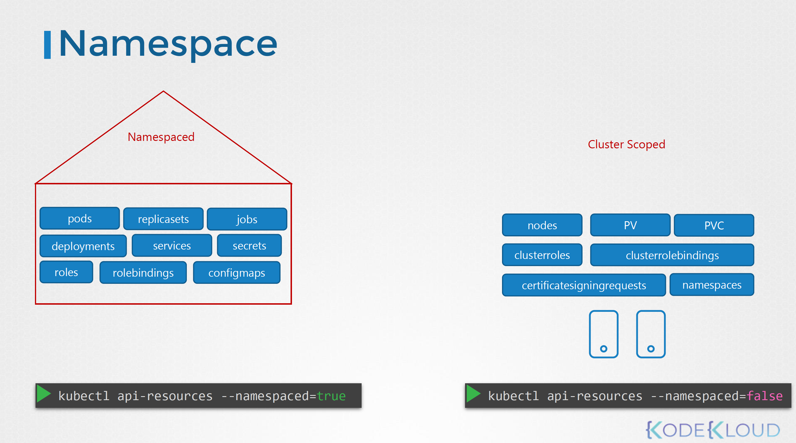
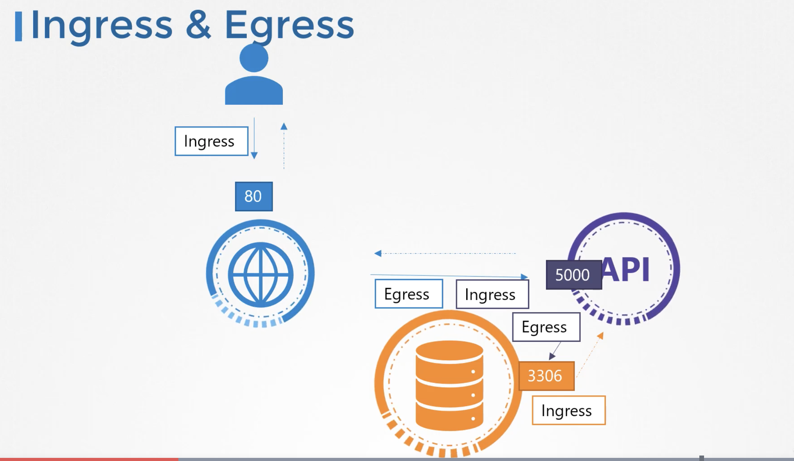
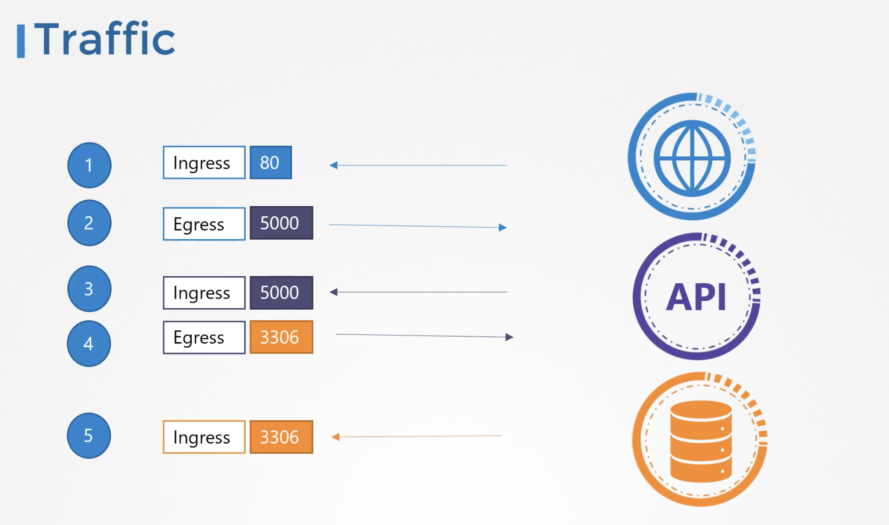

# Kubernetes for Kode Kloud - Security
> 

## 쿠버네티스 서비스계정 생성
```bash
bash> kubectl create serviceaccount sa1
bash> kubectl list serviceaccount
bash> curl -v -k https://localhost:6443/api/v1/pods -u "user1:password123"
```
* 패스워드 혹은 토큰 등을 통한 인증
  - 패스워드 파일 대신, 볼륨 마운트를 통한 인증을 검토하라
```yaml
# cat /etc/kubernetes/manifests/kube-apiserver.yaml
apiVersion: v1
kind: Pod
metadata:
  name: kube-apiserver
  namespace: kube-system
spec:
  containers:
  - command:
    - kube-apiserver
      <content-hidden>
    image: k8s.gcr.io/kube-apiserver-amd64:v1.11.3
    name: kube-apiserver
    volumeMounts:
    - mountPath: /tmp/users
      name: usr-details
      readOnly: true
  volumes:
  - hostPath:
      path: /tmp/users
      type: DirectoryOrCreate
    name: usr-details
```
* kube-apiserver 기동 시에 옵션을 변경합니다
```yaml
apiVersion: v1
kind: Pod
metadata:
  creationTimestamp: null
  name: kube-apiserver
  namespace: kube-system
spec:
  containers:
  - command:
    - kube-apiserver
    - --authorization-mode=Node,RBAC
      <content-hidden>
    - --basic-auth-file=/tmp/users/user-details.csv
```
* 롤과 롤바인딩을 생성합니다
```yaml
---
kind: Role
apiVersion: rbac.authorization.k8s.io/v1
metadata:
  namespace: default
  name: pod-reader
rules:
- apiGroups: [""] # "" indicates the core API group
  resources: ["pods"]
  verbs: ["get", "watch", "list"]
 
---
# This role binding allows "jane" to read pods in the "default" namespace.
kind: RoleBinding
apiVersion: rbac.authorization.k8s.io/v1
metadata:
  name: read-pods
  namespace: default
subjects:
- kind: User
  name: user1 # Name is case sensitive
  apiGroup: rbac.authorization.k8s.io
roleRef:
  kind: Role #this must be Role or ClusterRole
  name: pod-reader # this must match the name of the Role or ClusterRole you wish to bind to
  apiGroup: rbac.authorization.k8s.io
```

## TLS (Transport Layer Security) 인증 
> 암호화된 정보와 키를 같이 보내어 해독하는 방식을 대칭형 암호화(Symmetric Encryption)이라고 합니다. 평문 보다는 높은 보안이지만, 패킷캡쳐를 통해 해독이 가능합니다. 하여 비대칭 암호화 즉, Private Key 와 Public Lock 인 경우를 말하는데, Private Key 는 암호화만 가능하며, Public Key 는 해독만 가능합니다.


## [에단의 TLS](https://www.youtube.com/watch?v=EPcQqkqqouk)
* tracerout 명령을 통해 특정 URL 혹은 IP 로 접근하는 과정을 말해주는 도구 (윈도우는 tracert)
  - 나와 직접 서버와 연결되지 않고, 상당히 많은 과정을 거칩니다


## Practice Test View Certificate Details
* API, ETCD 서버의 인증(Certificate)정보 확인
```bash
bash> openssl x509 -in /etc/kubernetes/pki/apiserver.crt -text
bash> openssl x509 -in /etc/kubernetes/pki/etcd/server.crt -text
bash> openssl x509 -in /etc/kubernetes/pki/ca.crt -text
```
* ETCD 설정 파일 확인을 통해 문제점 파악하기
  - cert-file 위치 확인 /etc/kubernetes/pki/etcd/server.crt
```bash
bash> vi /etc/kubernetes/manifests/etcd.yaml
```


## 신규 관리자 인증서 추가
* [Managing Resources](https://kubernetes.io/docs/concepts/cluster-administration/manage-deployment/)
* openssl 명령을 통해 인증서를 생성합니다
```bash
bash> openssl genrsa -out suhyuk.key 2048
bash> openssl req -new -key suhyuk.key -subj "/CN=suhyuk" -out suhyuk.csr
```
* 생성된 인증파일을 통해 인증을 요청합니다
  - "cat suhyuk.csr | base64"
```yaml
apiVersion: certificates.k8s.io/v1
kind: CertificateSigningRequest
metadata:
  name: suhyuk
spec:
  groups:
  - system:authenticated
  request: LS0tLS1CRUdJTiBDRVJUSUZJQ0FURSBSRVFVRVNULS0tLS0KTUlJQ1ZqQ0NBVDRDQVFBd0VURVBNQTBHQTFVRUF3d0dZV3R6YUdGN
  signerName: kubernetes.io/kube-apiserver-client
  usages:
  - client auth
```
* 추가된 계정을 인증합니다
```bash
bash> kubectl get csr
... Pending
bash> kubectl certificate approve suhyuk
bash> kubectl certificate deny agent-smith
bash> kubectl delete csr agent-smith
bash> kubectl get csr suhyuk -o yaml
```
* 인증작업을 Scheduler 를 통해 수행되며, 백엔드에 ControllerManager 에 의해 운영됩니다
```bash
bash> cat /etc/kubernetes/manifests/kube-controller-manager.yaml
spec:
  containers:
  - command:
    - kube-controller-manager
    - --address=127.0.0.1
    - --cluster-signinig-cert-file=/etc/kubernetes/pki/ca.crt
    - --cluster-signinig-key-file=/etc/kubernetes/pki/ca.key
    ...
```


## KubeConfig 실습
* [Organizing Cluster Access Using kubeconfig Files](https://kubernetes.io/docs/concepts/configuration/organize-cluster-access-kubeconfig/)
```bash
bash> cat ~/.kube/config
bash> curl https://me-kube-playground:6443/api/v1/pods \
  --key admin.key \
  --cert admin.crt \
  --cacert ca.crt

bash> kubectl get pods \
  --server me-kube-playground:6443 \
  --client-key admin.key \
  --client-certificate admin.crt \
  --certificate-authority ca.crt
```
* 3개의 섹션으로 구성된 Config 파일을 생성합니다
  - 하나의 클러스터에 대한 구성
```yaml
apiVersion: v1
kind: Config
clusters:
- name: suhyuk-kube-playground
  cluster:
    certificate-authority: ca.crt
    server: https://suhyuk-kube-playground:6443
contexts:
- name: suhyuk-kube-admin@suhyuk-kube-playground
  context:
    cluster: suhyuk-kube-playground
    user: suhyuk-kube-admin
users:
- name: suhyuk-kube-admin
  user:
    client-certificate: admin.crt
    client-key: admin.key
```
  - 여러개의 클러스터에 대한 구성을 하며 current-context 를 통해 default context 를 설정합니다
```yaml
apiVersion: v1
current-context: psyoblade@ncsoft
kind: Config
clusters:
- name: suhyuk-kube-playground
- name: dev-kube-playground
- name: prod-kube-playground
- name: gcp-kube-playground
...
contexts:
- name: suhyuk-kube-admin@suhyuk-kube-playground
- name: psyoblade@ncsoft
...
users:
- name: suhyuk-kube-admin
...
```
* Config 보기 및 변경
```bash
bash> kubectl config view
bash> kubectl config view --kubeconfig=suhyuk-kube-playground
bash> kubectl config use-context prod-user@production
bash> kubectl config --kubeconfig=/root/my-kube-config use-context research # 해당 설정 파일에 구성된 내용을 기준으로 컨텍스트를 변경
bash> kubectl config -h
```
* "$HOME/.kube/config" 에 존재하는 파일을 변경할 수 있습니다
```yaml
apiVersion: v1
kind: Config
clusters:
- name: production
  cluster:
    certificate-authority: /etc/kubernetes/pki/ca.crt
    certificate-authority-data: `cat /etc/kubernetes/pki/ca.crt | base64`
```
* 이용자 인증 정보 위치
```bash
bash> ls -al /etc/kubernetes/pki/users/*/*
```


## RBAC (Role Based Access Control) 실습
* 각종 명령어 실습 
  - 1. 현재 기동된 설정 확인하기
  - 2. 현재 생성된 전체 롤 개수 확인하기
  - 3. 특정 롤의 상세 정보 확인
  - 4. 바인딩된 상세 정보 확인
```bash
bash> kubectl describe pod kube-apiserver-controlplane -n kube-system | grep authorization
bash> kubectl get roles --all-namespaces --no-headers | wc -l
bash> kubectl describe role kube-proxy -n kube-system
bash> kubectl describe rolebindings kube-proxy -n kube-system
```
* 롤을 생성하기
```yaml
apiVersion: rbac.authorization.k8s.io/v1
kind: Role
metadata:
  name: developer
rules
- apiGroups: [""]
  resources: ["pods"]
  verbs: ["list", "get", "create", "update", "delete"]
- apiGroups: [""]
  resources: ["ConfigMap"]
  verbs: ["create"]
```
* 롤을 특정 이용자에 바인딩하기
  - roleRef 값은 map 형태로 들어가야 하므로 arrya 형태인 - 가 들어가서는 안 된다
```yaml
apiVersion: rbac.authorization.k8s.io/v1
kind: RoleBinding
metadata:
  name: devuser-developer-binding
subjects:
- kind: User
  name: dev-user
  apiGroup: rbac.authorization.k8s.io
roleRef:
  kind: Role
  name: developer
  apiGroup: rbac.authorization.k8s.io
```
* 생성된 RBAC 정보를 확인합니다
```bash
bash> kubectl get roles
bash> kubectl get rolebindings
bash> kubectl describe role developer
bash> kubectl describe rolebinding devuser-developer-binding
```
* 권한 여부 확인하기
  - impersonate w/ --as <user-name>
```yaml
bash> kubectl auth can-i create deployments
bash> kubectl auth can-i delete nodes 

bash> kubectl auth can-i create deployments --as dev-user
bash> kubectl auth can-i delete nodes --as dev-user

bash> kubectl auth can-i create pods --as dev-user --namespace test
```
* 특정 파드의 이름에만 권한을 주는 경우
  - red, blue, orange, white, black 5가지 파드 가운데 blue 와 orange 에만 권한을 주고 싶다면?
```yaml
apiVersion: rbac.authorization.k8s.io/v1
kind: Role
metadata:
  name: developer
rules
- apiGroups: [""]
  resources: ["pods"]
  verbs: ["list", "create"]
```
```yaml
apiVersion: rbac.authorization.k8s.io/v1
kind: RoleBinding
metadata:
  name: dev-user-binding
subjects:
- kind: User
  name: dev-user
  apiGroup: rbac.authorization.k8s.io
roleRef:
  kind: Role
  name: developer
  apiGroup: rbac.authorization.k8s.io
```
```yaml
---
kind: Role
apiVersion: rbac.authorization.k8s.io/v1
metadata:
  namespace: blue
  name: deploy-role
rules:
- apiGroups: ["apps", "extensions"]
  resources: ["deployments"]
  verbs: ["create"]

---
kind: RoleBinding
apiVersion: rbac.authorization.k8s.io/v1
metadata:
  name: dev-user-deploy-binding
  namespace: blue
subjects:
- kind: User
  name: dev-user
  apiGroup: rbac.authorization.k8s.io
roleRef:
  kind: Role
  name: deploy-role
  apiGroup: rbac.authorization.k8s.io
```

## 클러스터 롤 및 클러스터 롤 바인딩
```bash
bash> kubectl api-resources --namespaced=true
bash> kubectl api-resources --namespaced=false
```


* 클러스터 노드에 대한 접근 롤 생성
```yaml
---
kind: ClusterRole
apiVersion: rbac.authorization.k8s.io/v1
metadata:
  name: node-admin
rules:
- apiGroups: [""]
  resources: ["nodes"]
  verbs: ["get", "watch", "list", "create", "delete"]

---
kind: ClusterRoleBinding
apiVersion: rbac.authorization.k8s.io/v1
metadata:
  name: michelle-binding
subjects:
- kind: User
  name: michelle
  apiGroup: rbac.authorization.k8s.io
roleRef:
  kind: ClusterRole
  name: node-admin
  apiGroup: rbac.authorization.k8s.iocontrolplane
```
* 클러스터 스토리지 어드민 롤 생성
```yaml
---
kind: ClusterRole
apiVersion: rbac.authorization.k8s.io/v1
metadata:
  name: storage-admin
rules:
- apiGroups: [""]
  resources: ["persistentvolumes"]
  verbs: ["get", "watch", "list", "create", "delete"]
- apiGroups: ["storage.k8s.io"]
  resources: ["storageclasses"]
  verbs: ["get", "watch", "list", "create", "delete"]

---
kind: ClusterRoleBinding
apiVersion: rbac.authorization.k8s.io/v1
metadata:
  name: michelle-storage-admin
subjects:
- kind: User
  name: michelle
  apiGroup: rbac.authorization.k8s.io
roleRef:
  kind: ClusterRole
  name: storage-admin
  apiGroup: rbac.authorization.k8s.iocontrolplane
```


## 이미지 보안
> 도커에서 "image: docker.io/nginx/nginx" 이미지 주소의 의미는 다음과 같습니다. 

* 이미지 주소의 의미
| Registry | User or Account | Image or Registry |
| --- | --- | --- |
| docker.io | nginx | nginx |

* 임의의 레포지토리 로그인
```bash
bash> docker login me.suhyuk.io
bash> docker run me.suhyuk.io/apps/internal-app
```
* 도커 개인 레지스트리 등록을 위한 시크릿 생성
```bash
bash> kubectl create secret docker-registry regcred \
  --docker-server = me.suhyui.io \
  --docker-username = username \
  --docker-password = password \
  --docker-email = username@me.suhyui.io
```
* 시크릿을 통한 이미지 기동
  - [Create a Pod that uses your Secret](https://kubernetes.io/docs/tasks/configure-pod-container/pull-image-private-registry/#create-a-pod-that-uses-your-secret)
```yaml
...
    spec:
      containers:
      - image: myprivateregistry.com:5000/nginx:alpine
        imagePullPolicy: IfNotPresent
        name: nginx
      imagePullSecrets:
      - name: private-reg-cred
...
```

## 보안 컨텍스트 사용하기
* 도커 실행 시에 이용자 설정하기
  - [User](https://docs.docker.com/engine/reference/run/#user) 에 숫자가 들어가면 UID로 사용되지만, 문자열의 경우 존재하는 유저여야 합니다
  - [Runtime privilege and Linux capabilities](https://docs.docker.com/engine/reference/run/#runtime-privilege-and-linux-capabilities)
```bash
bash> docker run --user=1001 ubuntu sleep 3600
bash> docker run --cap-add MAC_ADMIN ubuntu
```
* 보안 컨텍스트를 활용한 파드 생성 YAML
```yaml
apiVersion: v1
kind: Pod
metadata:
  name: pod-name
spec:
  containers:
  - name : ubuntu
    image: ubuntu
    command: ["sleep", "3600"]
    securityContext:
      runAsUser: 1000
      capabilities:
        add: ["MAC_ADMIN"]
```
* 현재 실행 중인 파드의 유저 확인
  - securityContext 는 변경되지 않으므로 삭제 후 다시 생성해야만 합니다
```bash
bash> kubectl exec -it ubuntu-sleeper -- whoami
bash> kubectl apply -f ubuntu-sleeper.yaml
The Pod "ubuntu-sleeper" is invalid: spec: Forbidden: pod updates may not change fields other than `spec.containers[*].image`, `spec.initContainers[*].image`, `spec.activeDeadlineSeconds` or `spec.tolerations` (only additions to existing tolerations)

bash> cat ubuntu-sleeper.yaml
apiVersion: v1
kind: Pod
metadata:
  name: ubuntu-sleeper
  namespace: default
spec:
  securityContext:
    runAsUser: 1010
  containers:
  - command:
    - sleep
    - "4800"
    image: ubuntu
    name: ubuntu-sleeper

```
* 내부 컨테이너의 실행 유저 덮어쓰기
  - The User ID defined in the securityContext of the POD is carried over to all the PODs in the container.
  - web 은 1002, sidecar 는 1001 
```yaml
apiVersion: v1
kind: Pod
metadata:
  name: multi-pod
spec:
  securityContext:
    runAsUser: 1001
  containers:
  -  image: ubuntu
     name: web
     command: ["sleep", "5000"]
     securityContext:
      runAsUser: 1002

  -  image: ubuntu
     name: sidecar
     command: ["sleep", "5000"]
```
* 내부 컨테이너를 통해 시스템 권한 부여하기
  - date 함수를 직접실행에 실패하므로, capabilities 에 SYS\_TIME 추가한 파드로 다시 생성합니다
  - 컨테이너에 제한된 설정이므로 반드시 container 항목 내부에 [securityContext](https://kubernetes.io/docs/tasks/configure-pod-container/security-context/) 를 지정합니다
```yaml
apiVersion: v1
kind: Pod
metadata:
  name: ubuntu-sleeper
  namespace: default
spec:
  containers:
  - name: ubuntu
    image: ubuntu
    securityContext:
      capabilities:
        add: ["SYS_TIME"]
    command: ["sleep", "4800"]
```
```bash
bash> kubectl exec -it ubuntu-sleeper -- date -s '19 APR 2012 11:14:00'
date: cannot set date: Operation not permitted
Thu Apr 19 11:14:00 UTC 2012

bash> kubectl delete pod ubuntu-sleeper
bash> kubectl create -f ubuntu-sleeper.yaml
bash> kubectl exec -it ubuntu-sleeper -- date -s '19 APR 2012 11:14:00'
```

## 네트워크 정책
* Ingress & Egress 는 컨테이너 수준에서 상대적인 방향을 나타내는 용어입니다





