# Kubernetes for Kode Kloud - Networking
> 네트워크에 대한 기본적인 지식을 습득하고 쿠버네티스에서 어떻게 활용되는지 학습합니다


## 1. Networking related Concepts

### Switching 
> 같은 네트워크 내에서 물리적인 IP 를 가진 호스트 간의 통신을 위한 장비

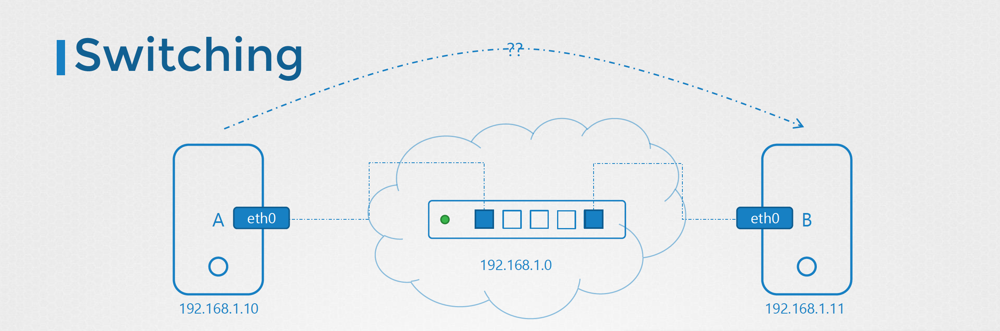
* ip 명령어를 통해 현재 네트워크 인터페이스(eth0)를 이용합니다
```bash
bash> ip link
18: eth0@if19: <BROADCAST,MULTICAST,UP,LOWER_UP,M-DOWN> mtu 1500 qdisc noqueue state UP
    link/ether 02:42:ac:11:00:02 brd ff:ff:ff:ff:ff:ff
bash> ip addr add 192.168.1.10/24 dev eth0 # 통해서 네트워크 IP 할당
bash> ping 192.168.1.11 # 같은 네트워크내의 장비와 통신
```

### Router
> 서로 다른 네트워크와 통신을 하기 위한 장비이며, 네트워크가 방이라고 하면 게이트웨이는 다른 방으로 향하는 문이라고 볼 수 있습니다. 

* 라우터(192.168.1.1)를 경유하여 최종 목적지인 스위치(192.168.2.0)로 도달합니다
  - 반대쪽의 호스트에서도 마찬가지로 라우팅 테이블에 장비를 추가해 주어야만 합니다
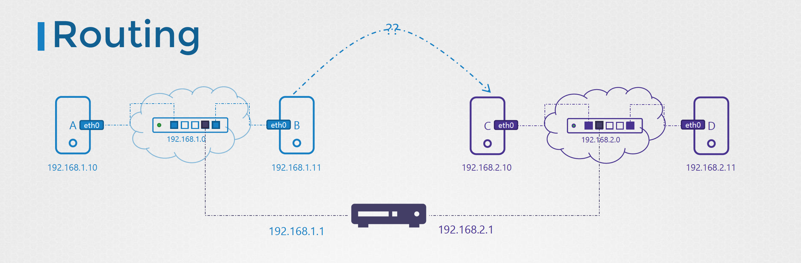

* 커널의 라우팅 테이블을 통해 확인할 수 있습니다
  - 서로 다른 네트워크는 라우팅 테이블에 존재하지 않는한 찾아낼 수 없습니다.
  - 커널 라우팅 함수를 통해 라우팅 테이블에 IP 와 포트를 관리합니다
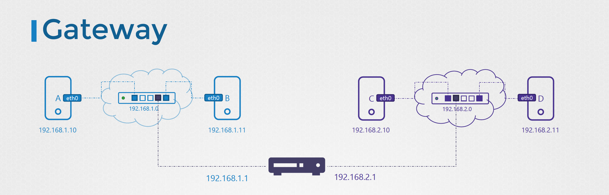
```bash
bash> route
Kernel IP routing table
Destination     Gateway         Genmask         Flags Metric Ref    Use Iface
default         172.17.0.1      0.0.0.0         UG    0      0        0 eth0
172.17.0.0      *               255.255.0.0     U     0      0        0 eth0

bash> ip route add [대상 IP 주소] via [라우터주소]

bash> ip route add 192.168.2.0/24 via 192.168.1.1    # A -> C
bash> ip route add 192.168.1.0/24 via 192.168.2.1    # D -> B
bash> ip route add 172.217.194.0/24 via 192.168.2.1  # B -> Internet
```

* 외부 인터넷과 연결에도 라우팅 테이블에 대한 IP정보가 필요합니다
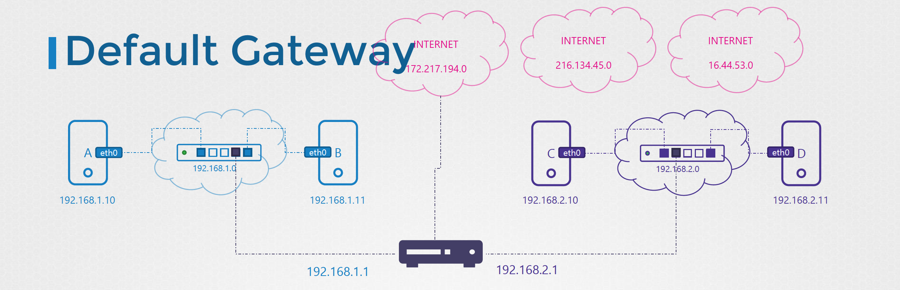

### Gatway
> 2개 이상의 라우터가 존재하는 경우 게이트웨이가 필요합니다

* 하나(192.168.1.0)는 내부네트워크이고, 나머지 하나(192.168.2.0)는 외부 인터넷 접속망 클러스터를 구축하는 경우
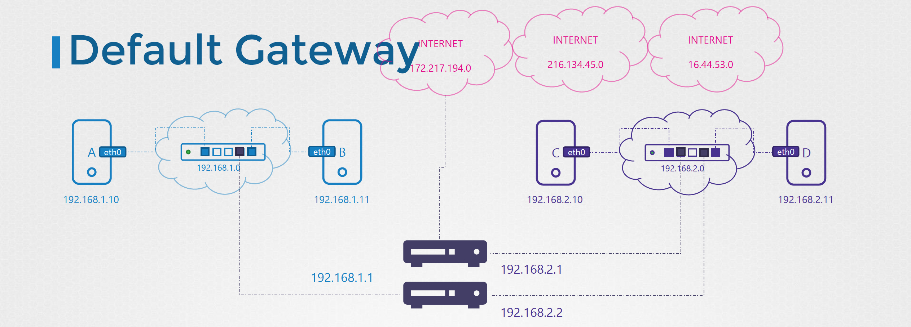

```bash
bash> ip route add default via 192.168.2.1         # for public
bash> ip route add 192.168.1.0/24 via 192.168.2.2  # for private

bash> route
Kernel IP routing table
Destination     Gateway         Genmask         Flags Metric Ref    Use Iface
default         172.17.0.1      0.0.0.0         UG    0      0        0 eth0
172.17.0.0      *               255.255.0.0     U     0      0        0 eth0
```

* 쿠버네티스의 노드 추가 방식
  - 2개 이상의 네트워크에 접속을 위해서는 2개 이상의 해당 네트워크 IP를 가진 NIC가 필요합니다
  - 스위치 혹은 라우터 대신 특정 호스트(192.168.?.6)를 이용하여 다른 클러스터의 스위치(192.168.?.0)을 통해 접속(192.168.2.5)도 가능합니다
  - 다만, 보안상의 이유로 ping 을 수행하는 경우 Unreachable 은 아니지만, 결과에 대한 값을 반환은 되지 않습니다 (아래의 ip\_forward 설정으로 가능)
```bash
bash> ip route add 192.168.2.0/24 via 192.168.1.6
bash> ping 192.168.2.5
bash> cat /proc/sys/net/ipv4/ip_forward
0
bash> echo 1 > /proc/sys/net/ipv4/ip_forward
1
bash> cat /etc/sysctl.conf
...
net.ipv4.ip_forward = 1
...
```

### Tools
```bash
bash> ip link # 호스트의 인터페이스를 나열하고 수정합니다
bash> ip addr # 해당 인터페이스에 할당된 ip 주소를 확인합니다
bash> ip addr add <switch-ip> <host> <network> # ip 주소 설정은 가능하지만, 시스템 재시작 시에 사라집니다
bash> ip route # 라우팅 테이블을 확인합니다 (route)
bash> ip route add # 라우팅 테이블에 항목을 추가합니다
bash> cat /proc/sys/net/ipv4/ip # ip forward 가 설정되었는지를 반환합니다 (0 or 1)
bash> arp
bash> route
bash> netstat -plnt
```

## DNS 
> 특정 시스템에 ip 를 통해 접근은 ip addr 과 route 를 통해 가능하지만, 호스트의 이름을 통해 접근을 위해서는 hosts 파일 혹은 DNS 등록이 필요합니다 

* 호스트가 늘어날 수록 hosts 파일 수정은 번거롭고, 오류가 늘어날 확률이 많기 때문에 DNS 서버를 통해 Host 명을 Resolve 하기 위해 운영합니다
  - 도메인 이름을 검색하기 위한 search 서버를 추가할 수 있습니다
```bash
bash> cat /etc/resolv.conf

nameserver 192.168.65.6
search     ncsoft.com
```

* DNS 서버와 로컬 호스트파일의 정보가 다른 경우는 로컬의 정보가 우선됩니다
  - 즉, 호스트파일에서 찾아서 없는 경우에 DNS 서버에서 찾게 됩니다 (비용을 감안하면 그럴 듯)
  - 다만, 이 우선 순위도  /etc/nsswitch.conf 파일에서 수정이 가능합니다 
  - 인터넷과 같이 우리가 관리하지 않는 DNS 는 Public Nameserver 를 resolv.conf 에 추가합니다
  - 도메인 네임의 경우에 위계에 따른 룩업 시간을 줄이기 위해 캐시를 활용하기 위해 DNS 서버를 활용합니다

### Type of Records
|| 유형 || 키 || 값 || 설명 ||
| --- | --- | --- | --- |
| A | web-server | 192.168.1.1 | A 레코드는 IP 를 가지는 유형 |
| AAAA | web-server | 2001:0db8:85a3:0000:0000:8a3e:0370:7334 | AAAA 레코드는 IPv4 를 가지는 유형 |
| CNAME | food.web-server | eat.web-server, hungry.webserver | 이름으로 맵핑을 할 수 있는 유형 |

* **nslookup**
  - 명령을 통해 DNS 서버에 entry 를 lookup 할 수 있습니다

* **dig**
  - DNS name resolution 을 할 수 있는데 다양한 기능이 제공됩니다

### [CoreDNS](https://github.com/coredns/coredns) 서비스

* [Kubernetes DNS-Based Service Discovery](https://github.com/kubernetes/dns/blob/master/docs/specification.md)
  - [CoreDNS](https://coredns.io/plugins/kubernetes/)

* make 시에 참고할 만한 키워드
  - 아래와 같이 go 환경을 구성하지 않고도 빌드가 가능합니다
```bash
bash> docker run --rm -i -t -v $PWD:/v -w /v golang:1.14 make
```


## 2. Network Namespaces
> 쿠버네티스 내에서 컨테이너 간의 격리를 위해 네임스페이스를 활용합니다. 컨테이너에서 바라보는 프로세스 ID 이름과 호스트에서 바라보는 것이 다른 것처럼, 서로 다른 네임스페이스를 통해 컨테이너 간의 격리를 합니다

* 컨테이너 초기 생성 시에는 해당 컨테이너를 위한 별도의 네트워크(veth0, routing/arp table) 환경을 제공합니다
  - ARP Table - IP 주소와 MAC 주소를 연결하는 맵핑 테이블
  - ip 명령을 통해서 네트워크의 네임스페이스(netns)로 추가할 수 있습니다
```bash
bash> ip netns add red
bash> ip netns add blue
```

* 생성된 네트워크 네임스페이스를 서로 연결하고, 각 네트워크 인터페이스에 연결합니다
  - 이러한 가상의 네트워크 내에 가상의 스위치를 생성하여 각 네트워크를 연결합니다
  - 여기서 LINUX BRIDGE(Open vSwitch) 네트워크가 그것이며, 이를 통해 가상의 네트워크 스위치를 생성합니다
  - 해당 브리지 네트워크를 가상의 네트워크 주소와 연결하는데 (물리적인 랜선을 연결하는 것과 유사하게) 이 때에 내부 브리지 네트워크가 구성됩니다
```bash
bash> ip link add veth-red type veth peer name veth-blue
bash> ip link set veth-red netns red
bash> ip link set veth-blue netns blue

bash> ip -n red addr add 192.168.15.1 dev veth-red
bash> ip -n blue addr add 192.168.15.2 dev veth-blue

bash> ip -n red link set veth-red up
bash> ip -n blue link set veth-blue up

bash> ip netns exec red ping 192.168.15.2
bash> ip netns exec red arp
bash> ip netns exec blue arp
bash> arp

bash> ip link add v-net-0 type bridge
bash> ip link
bash> ip link set dev v-net-0 up
```
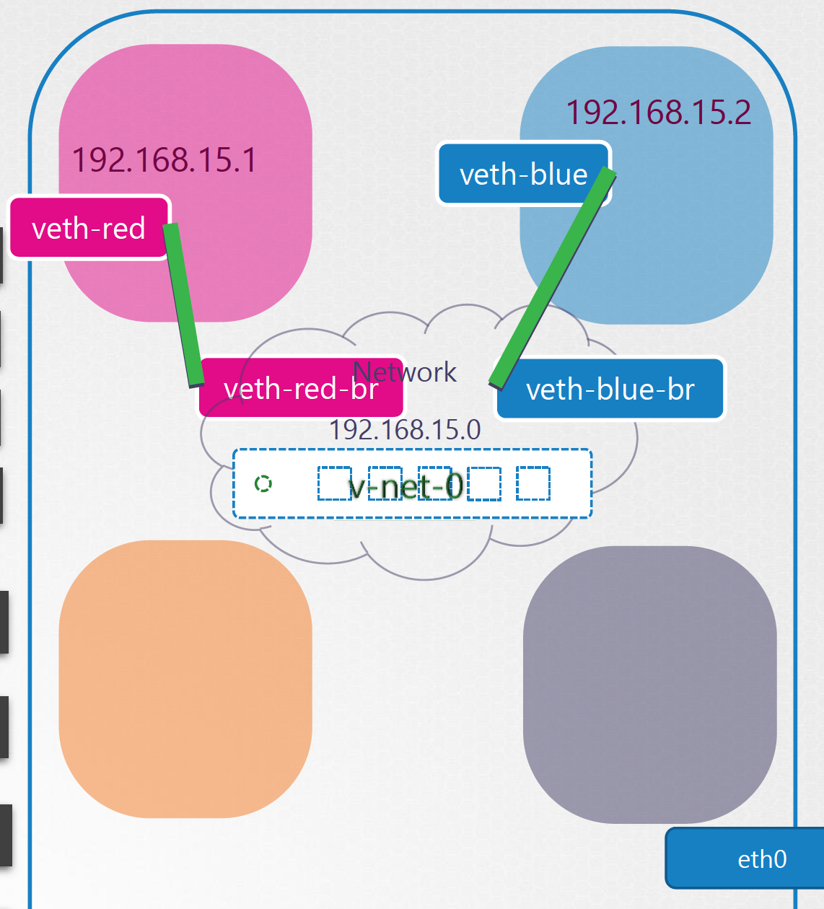

* 1. 컨테이너의 가상 네트워크에서 외부 노드로 접근하는 방법
  - 호스트의 노드가 게이트웨이 역할을 하고 해당 호스트를 통해 외부로 접근합니다
  - 네임스페이스 명령을 통해 호스트를 게이트웨이로 사용하여 접근하고자 하는 라우터의 엔트리를 추가합니다
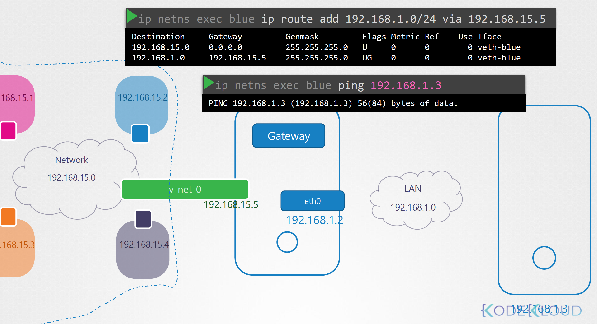

* 2. 컨테이너의 패킷을 호스트가 보내는 것으로 가장하기 위한 방법
  - 컨테이너의 정보로 전달되면 안되므로 iptables 를 이용하여 호스트가 보내는 것 처럼 가장합니다
```bash
bash> iptables -t nat -A POSTROUTING -s 192.168.15.0/24 -j MASQUERADE
```

* 3. 외부에서 다시 가상 컨테이너로 접근하는 방법
  - 사설 IP 접근으로는 불가능하므로, NAT 를 이용하거나 Port Forwading 을 사용하는 방법입니다
  - NAT: 사설 네트워크 ID를 제공하는 방법은 적절하지 않기 때문에...
  - PortForward: 특정 IP:PORT로 요청되는 모든 트래픽을 특정 사설 IP:PORT로 포워드합니다
```bash
bash> iptables -t nat -A PREROUTING --dport 80 --to-detination 192.168.15.2:80 -j DNAT
```


## 3. Docker Networking
> 도커에서 어떻게 네트워크를 구성하고 활용하는지 학습합니다

* 크게 None, Host, Bridge, Overlay 등으로 구성됩니다
  - none : 외부와 단절된 네트워크 구성 
  - host : 호스트와 격리된 네트워크 구성이 아니라 동일하게 공유합니다
  - bridge : 내부 사설 망을 구성하여 관리하면 기본 네트워크 드라이버입니다
```bash
bash> docker run --network none nginx
bash> docker run --network host nginx
```

* Bridge Network
  - 기본으로 생성되는 네트워크인데 호스트에서는 docker0 라는 이름으로 생성됩니다 ([맥 환경에서는 docker0 네트워크가 없습니다](https://docs.docker.com/docker-for-mac/networking/#there-is-no-docker0-bridge-on-macos))
  - 도커가 컨테이너 생성시에 네트워크 네임스페이스가 생성되며 가상의 케이블이 호스트의 로컬 브릿지 네트워크에 연결되며, 이는 컨테이너 내부의 가상의 이더넷에 연결됩니다. 또 다른 컨테이너가 생성될 때에 eth0@if# 형태로 여러 컨테이너가 블릿지 네트워크에 연결됩니다.
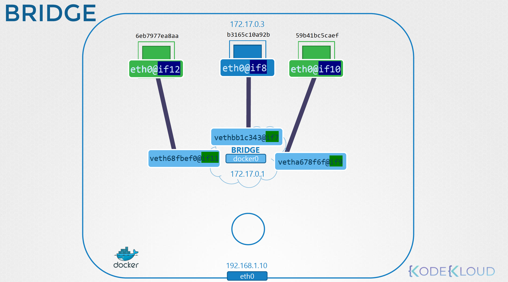

  - 해당 브릿지 네트워크에 IP:PORT 접근 시에 해당 브릿지 네트워크는 각 컨테이너로 포트포워드를 통해 접근할 수 있도록 지원합니다
  - 이는 도커 실행 시에 -p HOST:GUEST 형식으로 포트 퍼블리싱을 지정할 수 있습니다 (ex_ 이전 장의 iptables 명령을 이용합니다)
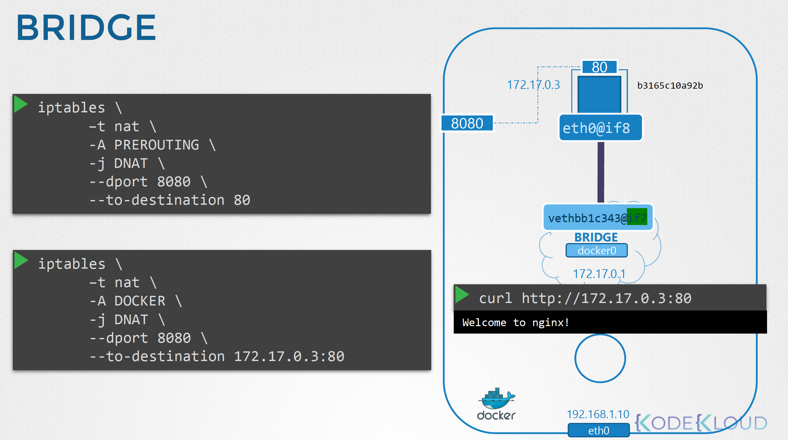


## 4. Network CNI (Continaer Network Interface)
> 네트워크 구성이 docker, rkt, mesos 등과 어떻게 동일하거나 다른지 비교하면서 학습합니다.
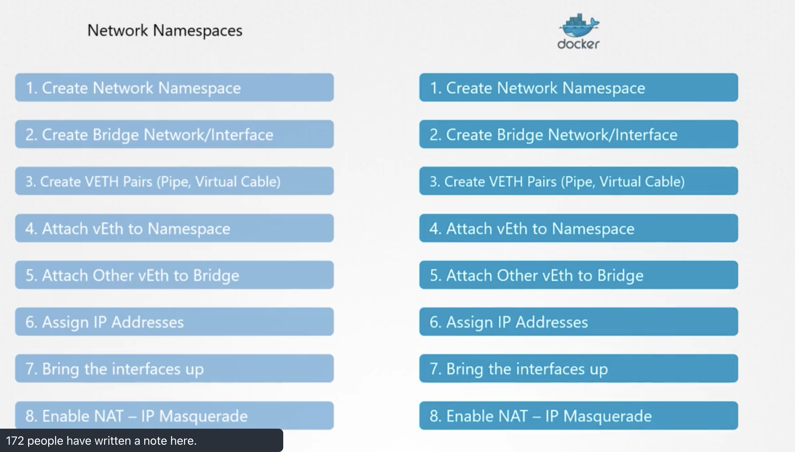

* 각종 런타임은 CNI 표준을 지키는 다양한 네트워크 인터페이스를 사용할 수 있습니다. (weaveworks, flannel, cilium, NSX 등) 하지만 도커는 CNI 표준을 준수하고 있지 않으며, 현재는 CNM (Container Network Model)을 사용하고 있습니다.
```bash
bash> docker run --network=cni-bridge nginx # 는 동작하지 않습니다
bash> docker run --network=none nginx
$ bridge add 2e34dcf34 /var/run/netns/2e34dcf34  # 와 같이 수동으로 등록해 주어야만 하므로, K8S도 동일하게 구성합니다
```

### Networking Cluster Nodes
> 클러스터의 마스터와 워커 노드에도 각각 특정 포트를 통해 통신을 하게 되며, 어떻게 통신하게 되는지 학습합니다

* 마스터의 각 노드들이 개별 포트에 
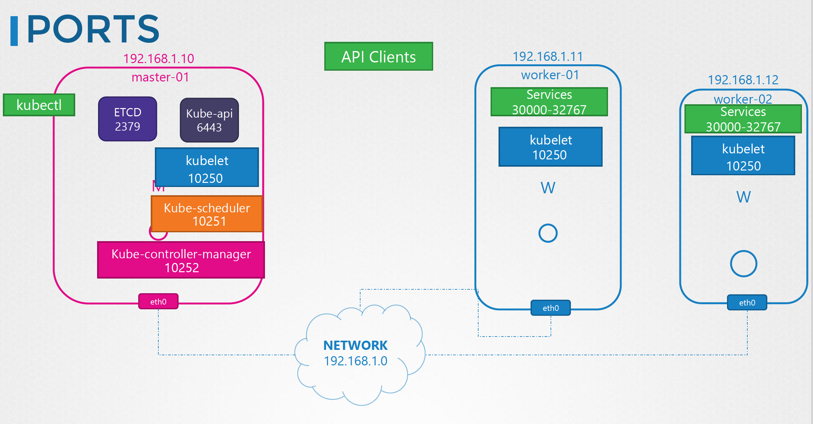

* [Install Kubernetes](https://kubernetes.io/docs/setup/production-environment/tools/kubeadm/install-kubeadm/#check-required-ports)
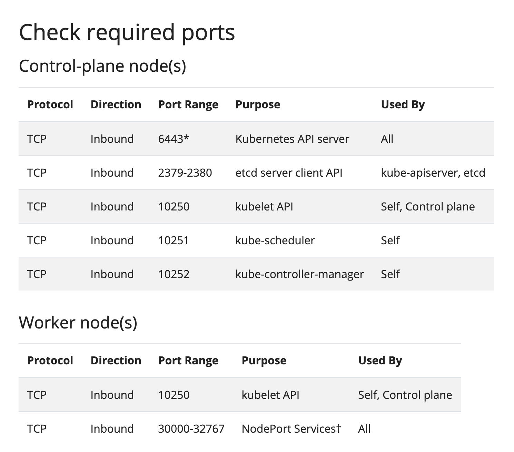

* [Installing Addons](https://kubernetes.io/docs/concepts/cluster-administration/addons/)
  - [How to implement the Kubernetes networking model](https://kubernetes.io/docs/concepts/cluster-administration/networking/#how-to-implement-the-kubernetes-networking-model)
  - [Stacked control plane and etcd nodes - Steps for the first control plane node](https://kubernetes.io/docs/setup/production-environment/tools/kubeadm/high-availability/#steps-for-the-first-control-plane-node)

* 네트워크 환경 확인 명령어 실습
```bash
bash> kubectl get nodes
bash> ifconfig -a
bash> cat /etc/network/interfaces
bash> ip link show ens3

bash> ifconfig ens3   # ifconfig <interface-name>
bash> ssh node01 ifconfig ens3   # check specific server

bash> ssh node01 ifconfig -a     # check network interface
bash> ssh node01 ip link

bash> ip route   # ip r
bash> ip route show default
bash> netstat -nplt | grep kube-scheduler
```
  - 여기서 왜 default network 가 외부 접속인가?


