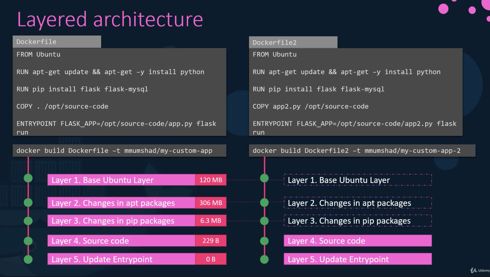
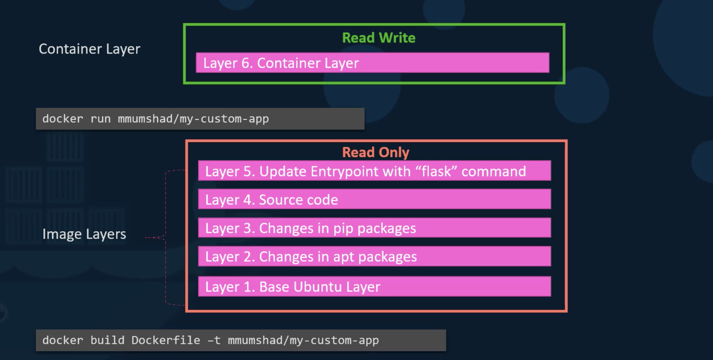
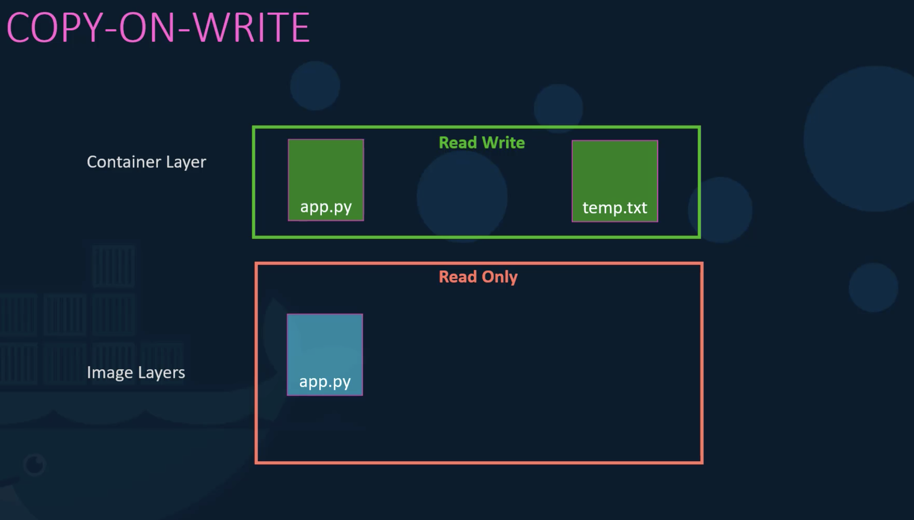
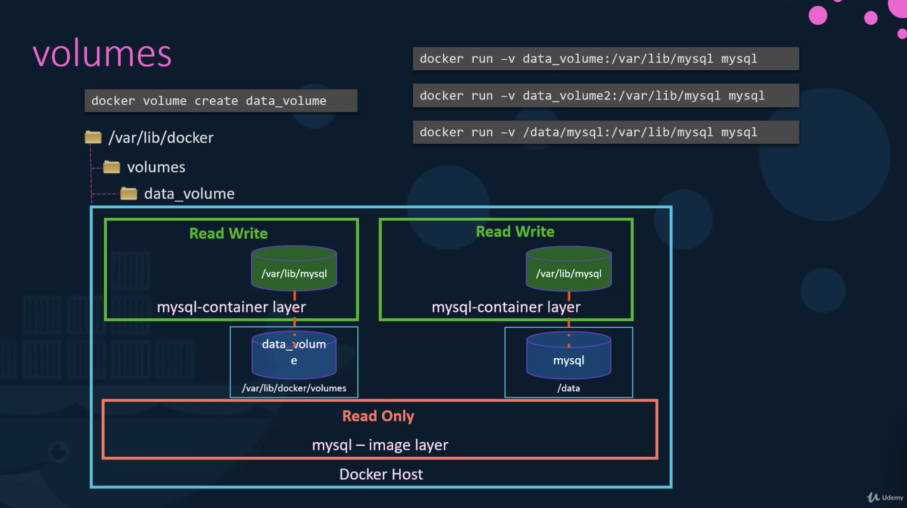
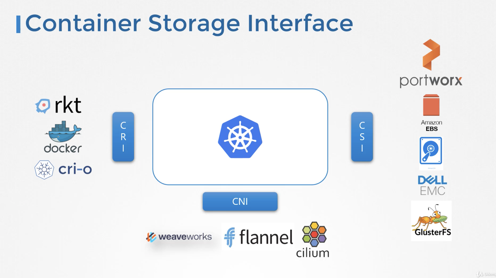
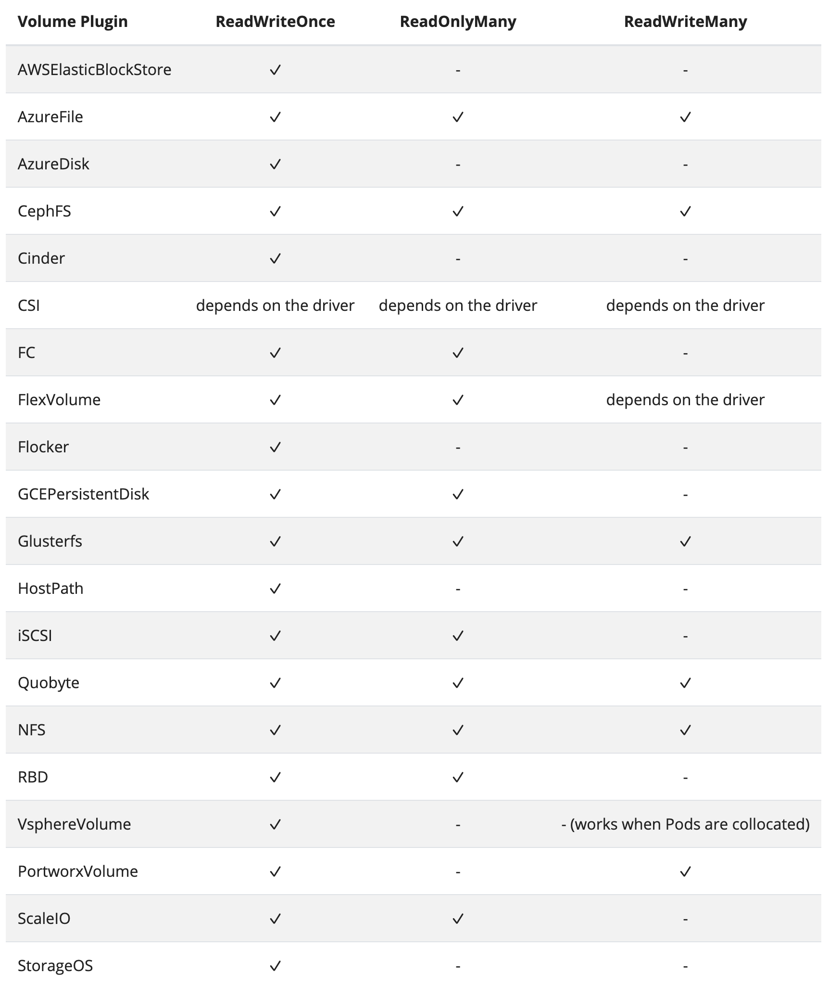
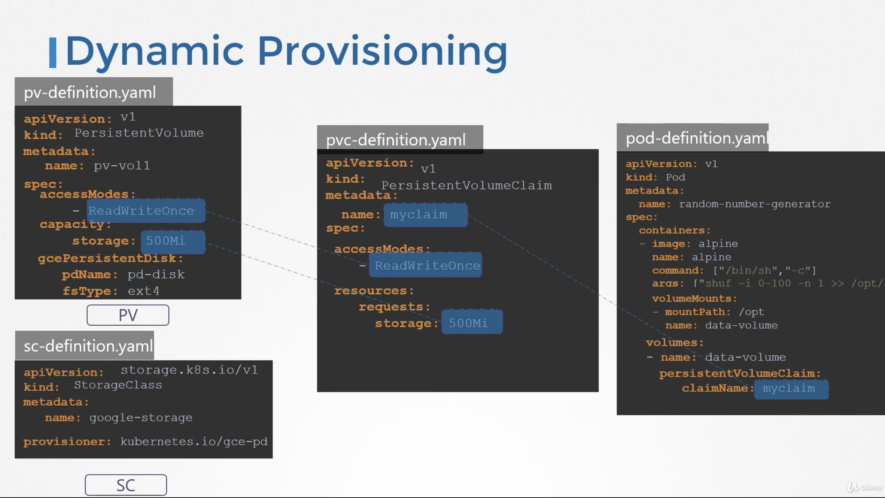
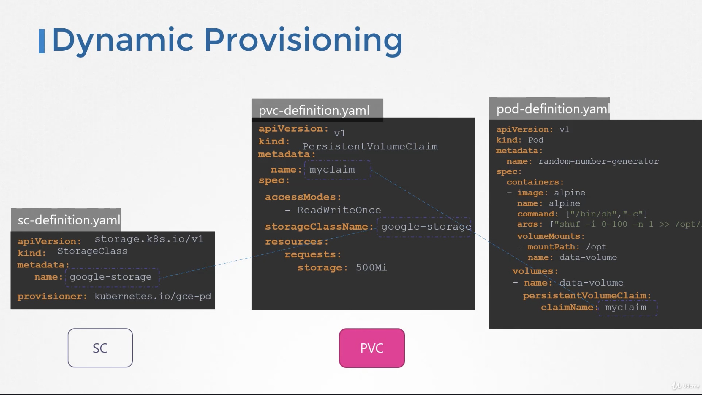

# Kubernetes for Kode Kloud - Storage
> 스토리지의 종류는 Storage Drivers, Volume Drivers 이렇게 2가지가 존재하며, 도커가 어떻게 로컬 파일시스템과 동작하는지 학습합니다

## 도커 스토리지
> 초기에 도커 설치시에 /var/lib/docker 라는 경로 아래에 aufs, containers, **image, volumes** 와 같은 경로가 생깁니다


* **Image Layer** - 도커 빌드시에 발생하는 레이어 구성
  - 도커파일의 각 라인마다 새로운 레이어를 구성하고 겹겹히 이미지가 생성됩니다
  - 새로운 빌드 시에 과거에 존재하는 이미지 레이어와 동일한 경우 캐시를 활용합니다
  - 캐시를 사용함으로써 빌드 성능을 높이고, 저장구조도 효과적입니다



* **Container Layer** - 도커 컨테이너 실행 및 수정시의 레이어 구성
  - 새로운 컨테이너 실행 시에 기존의 빌드된 이미지는 수정할 수 없으며, 컨테이너 레이어인 Read/Write 가능한 Container Layer 가 생성됩니다
  - 이미지 레이어를 통해 생성된 파일의 경우에도 수정된 파일은 Container Layer 에서 새로 생성되어 별도의 레이어를 통해 사용됩니다


* **Volumes** - 도커에서 사용하는 볼륨에 대한 구성
  - Volume Mounting : 도커에서 관리하는 저장소에 생성된 볼륨을 컨테이너에서 사용하는 경우
  - Bind Mounting : 호스트에서 관리하는 별도의 저장소를 컨테이너에서 마운트해서 사용하는 경우
```bash
bash> docker run -v volume_mount:/var/lib/mysql mysql  # new-volume-mount-style
bash> docker run -v /bind/mount:/var/lib/mysql mysql   # new-bind-mount-style
bash> docker run --mount type=bind,source=/bind/mount,target=/var/lib/mysql mysql  # old-bind-mount-style
```

* 도커 스토리지 드라이버
  - 여러가지 저장소 드라이버(AUFS, ZFS, BTRFS, Device Mapper, Overlay, Overlay2)가 존재하면, 운영체제나 요구 사항에 따라 선택할 수 있습니다


* 도커 볼륨 드라이버 플러그인
  - 도커는 파일을 직접 사용하지 않고, 볼륨 드라이버를 통해 저장관리하며, 기본이 Local 이며 외에도 Azure 등 다양한 볼륨 드라이버를 통해 수행됩니다


* 컨테이너 스토리지 인터페이스 (CSI)
  - 도커가 CRI (Container Runtime Interface)를 통해 개발 구성되듯이 볼륨 또한 CSI 인터페이스를 통해 구현 및 연동됩니다


## 퍼시스턴트 볼륨
> 관리자가 영구적인 볼륨을 생성하는 방법에 대해 이해합니다

* (Access Mode](https://kubernetes.io/docs/concepts/storage/persistent-volumes/#access-modes)
  - RWO (ReadWriteOnce) -- the volume can be mounted as *read-write by a single node*
  - ROX (ReadOnlyMany) -- the volume can be mounted *read-only by many nodes*
  - RWX (ReadWriteMany) -- the volume can be mounted *as read-write by many nodes*



* Local Storage
```yaml
apiVersion: v1
kind: PersistentVolume
metadata:
  name: pv-vol1
spec:
  accessModes:
  - ReadWriteOnce
  capacity:
    storage: 1Gi
  hostPath:
    path: /tmp/data
```
* AWS Block Stroage
```yaml
apiVersion: v1
kind: PersistentVolume
metadata:
  name: pv-vol1
spec:
  accessModes:
  - ReadWriteOnce
  capacity:
    storage: 1Gi
  awsElasticBlockStore:
    voluemId: <volume-id>
    fsType: ext4
```

## 퍼시스턴트 볼륨 클레임
> 이용자가 영구적인 볼륨 사용을 요청하는 것을 이해합니다. Claim 은 특정 PV 를 요청하고 해당 PVC 두 개의 객체를 적절하게 연결하는 과정이며, 하나의 PV 가 PVC 에 바인딩되는 경우 해당 PV의 여유공간이 크다고 하더라도 다른 PVC 에 바인딩 될 수 없습니다. 즉, PV 와 PVC 는 1:1 입니다.

* PV 와 PVC 바인딩 요건
  - Sufficient Capacity
  - Access Modes
  - Volume Modes
  - Storage Class
  - Selector

* PVC & PV 생성 예제
  - pvc-definition.yml
```yaml
apiVersion: v1
kind: PerssitentVolumeClaim
metadata:
  name: myclaim
spec:
  accessModes:
  - ReadWriteOnce
  resource:
    requests:
      storage: 500Mi
```
  - pv-definition.yml
```yaml
apiVersion: v1
kind: PerssitentVolume
metadata:
  name: pv-vol1
spec:
  accessModes:
  - ReadWriteOnce
  capacity:
    storage: 1Gi
  awsElasticBlockStore:
    volumeID: <volume-id>
    fsType: ext4
```
* PVC 삭제 과정의 이해
  - 내가 요청한 클레임을 삭제하는 것이지, 볼륨을 직접 삭제하지 않으며, 이는 "persistentVolumeReclaimPolicy: Retain" 옵션에 따라 다르게 동작합니다
    - Retain 옵션이 주어지는 경우는 Administrator 가 삭제하기 전까지는 삭제되지 않으며, 해당 볼륨은 어떤 PVC의 요청에도 사용되어지지 않습니다
    - Delete 옵션은 PVC와 같이 자동적으로 삭제됩니다
    - Recycle 옵션은 다른 PVC에 사용될 수 있도록 스크럽 됩니다 
```bash
bash> kubectl delete persistentvolumeclaim myclaim
```
* 파드에서 PVC 사용 예제
  - [Claims As Volumes](https://kubernetes.io/docs/concepts/storage/persistent-volumes/#claims-as-volumes)

* 로컬 저장소 사용
```yaml
apiVersion: v1
kind: Pod
metadata:
  name: frontend-nginx
spec:
  containers:
    - name: frontend
      image: nginx
      volumeMounts:
      - mountPath: /webapp/log
        name: accesslog
  volumes:
    - name: accesslog
      hostPath:
        path: /var/log/webapp
```
* 블록 스토리지 사용
```yaml
apiVersion: v1
kind: Pod
metadata:
  name: mypod
spec:
  containers:
    - name: myfrontend
      image: nginx
      volumeMounts:
      - mountPath: "/var/www/html"
        name: mypd
  volumes:
    - name: mypd
      persistentVolumeClaim:
        claimName: myclaim
```

## 스토리지 클래스
> 구글 클라우드에서 볼륨을 사용하기 위해서는 사전에 디스크를 추가해 주어야만 합니다.
* Static Provisioning
  - [gcloud compute disks create](https://cloud.google.com/sdk/gcloud/reference/compute/disks/create)
  - PV, PVC 를 통한 연동 시에는 중복된 값들이 포함되어 있고 맞춰줘야하는 불편함이 있습니다
```bash
bash> gcloud compute disks create --size 1GB --region us-east1 pd-disk
bash> cat pv-definition.yml
apiVersion: v1
kind: PersistentVolume
metadta:
	name: pv-vol1
spec:
	accessModes:
		- ReadWriteOnce
	capacity:
		storage: 500Mi
	gcePersistentDisk:
		pdName: pd-isk
		fsType: ex4
```

* Dynamic Provisioning
  - 구글 스토리지의 경우 PVC에만 관련 정보를 추가하면 되고 storgeClassName 만 명시하면 됩니다
  - 다양한 클래스의 스토리지를 지정하기만 하면 그에 따른 저장소를 얻게 됩니다
```yaml
---
apiVersion: stroage.k8s.io/v1
kind: StorageClass
metadata:
	name: google-storage
provisioner: kubernetesio/gce-pd
parameters:
	type: pd-standard [ pd-standard | pd-ssd ]
	replication-type: none [ none | regional-pd ]
---
apiVersion: v1
kind: PersistentVolumeClaim
metadata:
	name: myclaim
spec:
	accessModes:
		- ReadWriteOnce
	storageClassName: google-storage
	resources:
		requests:
			storage: 500Mi
```


* 스토리지 클래스 가져오기
  - 로컬 스토리지의 경우는 동적인 프로비저닝([Dynamic Provisioning](https://kubernetes.io/docs/concepts/storage/storage-classes/#local)을 지원하지 않습니다.
```bash
bash> kubectl get sc
bash> cat pvc.yml
apiVersion: v1
kind: PersistentVolumeClaim
metadata:
  name: local-pvc
spec:
  accessModes:
    - ReadWriteOnce
  storageClassName: local-storage
  resources:
    requests:
      storage: 500Mi
```
> The Storage Class called local-storage makes use of VolumeBindingMode set to WaitForFirstConsumer. This will delay the binding and provisioning of a PersistentVolume until a Pod using the PersistentVolumeClaim is created.

```yaml
apiVersion: v1
kind: Pod
metadata:
	name: nginx
spec:
	containers:
		- name: nginx
			image: nginx:alpine
			volumeMounts:
			- mountPath: /var/www/html
				name: local-pvc
	volumes:
		- name: local-pvc
			persistentVolumeClaim:
				claimName: local-pvc
```

```yaml
apiVersion: storage.k8s.io/v1
kind: StorageClass
metadata:
	name: delayed-volume-sc
provisioner: kubernetes.io/no-provisioner
volumeBindingMode: WaitForFirstConsumer
```
